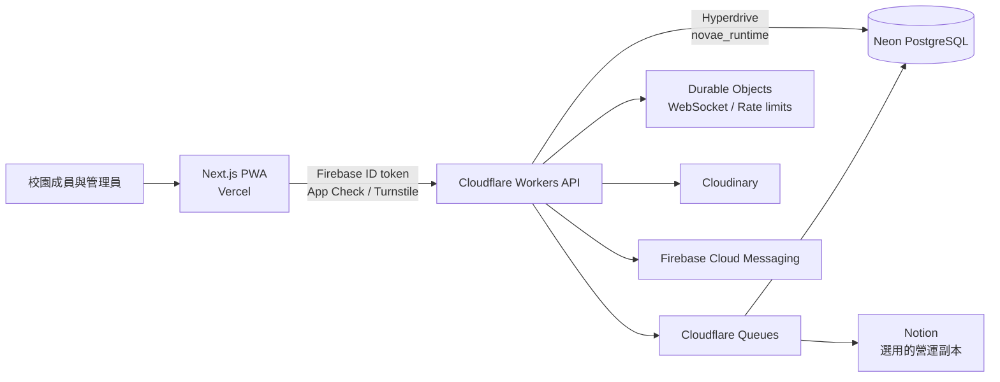

# Novae


Novae 是給校園社群使用的開源治理 PWA。學生可提出公共議題、回報設施問題、附議、討論並追蹤處理結果；校方則在同一套系統發布公告、管理分類與權限、處理案件並查看營運狀態。

系統以單一學校為部署單位。登入資格由 Google 帳號網域限制，平台管理員只由 Worker 的 `ADMIN_EMAILS` 決定，分類管理員則依明確的 category scope 授權。

## 問題與目標

校園議題常散在表單、社群貼文、私訊和紙本流程裡。提出者不知道案件走到哪一步，其他人看不到附議與回覆期限，管理方也很難把公開提案、私密權益案件、設施回報和公告放在同一套權限模型下處理。

Novae 把這些流程收進一個可安裝的 Web App：內容狀態與期限對成員可見，管理權限綁定到明確 category，所有寫入由同一個 Worker API 進入 PostgreSQL transaction。通知、Push、Realtime 與選用的 Notion 營運副本從已落庫的 domain event 衍生，不讓外部服務成為主要資料來源。

## 核心功能

- 公共提案：依分類設定公開範圍、匿名顯示、附議門檻、附議期限、回覆期限與留言權限。
- 權益案件：支援審核後公開或僅作者與管理員可見的處理流程。
- 設施回報：追蹤受影響人數、處理狀態與結案說明。
- 公告與討論：公告、按讚、留言、回覆及圖片附件。
- 通知：站內通知、Web Push，以及透過 Durable Object WebSocket 傳遞的即時更新。
- 管理：首次分類設定、分類權限、使用者限制、資料保留政策、背景工作與稽核紀錄。
- PWA：可安裝、離線資產快取、版本更新提示、響應式導覽與中英文介面。

## 系統架構



瀏覽器只呼叫 Worker，不持有資料庫憑證。Worker action 與 PostgreSQL RPC 共同執行權限檢查；寫入產生的 domain event 會與主要資料在同一個 transaction 中記錄，再由 Queue 分送到站內通知、Push、Realtime 或選用的 Notion 副本。完整說明見[系統架構](docs/architecture.md)與[後端及資料層](docs/backend-and-data.md)。

一次一般寫入會經過這條路徑：

1. Browser 取得 Firebase ID token、App Check token，以及 write operation 的 UUID。
2. Worker 驗證 Origin、身分、rate limit、permission 和 category scope。
3. PostgreSQL transaction claim operation、執行 RPC、記錄 audit / event，再保存 canonical response。
4. Worker 回應 client，Queue 在背景處理站內通知、FCM、Realtime 和 Notion delivery。
5. Browser 收到 realtime revision 後只讓受影響 cache 失效；若 revision 出現缺口，就重新讀 authoritative data。

## 技術棧

| 層級 | 技術 | 實際用途 |
| --- | --- | --- |
| Web | Next.js 16.3 App Router、React 19.2、TypeScript 7 | 路由、PWA 介面、SSR/RSC 與 client state |
| UI | Tailwind CSS 4、Radix UI、HeroUI、Motion | Design tokens、可存取元件與狀態轉場 |
| PWA | Serwist 9 | Service Worker、安裝與版本更新流程 |
| 身分與裝置 | Firebase Authentication、App Check、Cloud Messaging | Google 登入、app attestation、Web Push |
| API | Cloudflare Workers、Hyperdrive | 驗證、action dispatch、資料庫連線與媒體代理 |
| 非同步與即時 | Cloudflare Queues、Durable Objects | Event delivery、背景批次、WebSocket、業務 rate limit |
| 資料庫 | Neon PostgreSQL 17、`pg` | 交易、RPC、RBAC、稽核與資料保留 |
| 媒體與整合 | Cloudinary、Notion API（選用） | 簽名圖片與營運紀錄副本 |
| 工具與測試 | Bun 1.4、Vitest 4、Playwright 1.62、ESLint 9 | 產物生成、靜態檢查、整合與瀏覽器測試 |

Novae 沒有接入生成式 AI 模型；目前的自動化集中在事件投遞、資料維護與部署驗證。

## 快速開始

需要 Node.js 24、Bun 1.4，以及可執行 Linux container 的 Docker。Windows 會由專案腳本透過 WSL 啟動 Docker。

```bash
bun install --frozen-lockfile
bun run test:env
```

`test:env` 會重建本機 PostgreSQL、套用 migration 和 sample seed，接著啟動 Firebase Auth Emulator、外部服務 stub、Cloudflare Worker 與 Next.js。Ready 後可使用：

- App：`http://127.0.0.1:3000`
- API：`http://127.0.0.1:8787`
- Auth Emulator：`http://127.0.0.1:4000/auth`

按 `Ctrl+C` 會停止這次啟動的服務。若要接真實 Firebase 或 Cloudinary 進行手動開發，改走[本機開發](docs/local-development.md)與[設定參考](docs/configuration.md)。

常用驗證：

```bash
bun run verify:local        # 前端、型別、lint、unit、architecture、build、audit
bun run verify:integration  # PostgreSQL、Worker、權限、RPC、Queue、Realtime
bun run verify:all          # local + integration + Playwright E2E
```

## 文件

- [文件索引](docs/README.md)
- [產品與使用流程](docs/product.md)
- [路由、角色與權限](docs/routes-and-permissions.md)
- [系統架構](docs/architecture.md)
- [後端及資料層](docs/backend-and-data.md)
- [事件、即時更新、通知與圖片](docs/events-realtime-and-media.md)
- [執行期政策與限制](docs/runtime-policies.md)
- [設定參考](docs/configuration.md)
- [本機開發](docs/local-development.md)
- [部署與維運](docs/deployment-and-operations.md)
- [測試與驗證](docs/testing.md)

## 現行邊界

- 每個部署服務一個學校網域，不是多租戶 SaaS。
- 登入只支援符合 `ALLOWED_DOMAIN` 的 Google 帳號。
- 圖片流程依賴 Cloudinary；Notion 同步可以完全關閉。
- Web Push、PWA 安裝及背景行為仍受瀏覽器與作業系統能力限制。
- 資料庫變更只接受新的 forward migration；已套用的 migration 不會回改。

## 第三方服務與授權

| 服務或素材 | 必要性 | Novae 使用方式 |
| --- | --- | --- |
| Vercel | 正式部署需要 | Next.js frontend build 與 hosting |
| Cloudflare Workers / Hyperdrive / Queues / Durable Objects | 必要 | API、PostgreSQL connection、背景工作、Realtime、業務 rate limit |
| Neon | 必要 | PostgreSQL source of record |
| Firebase Authentication / App Check / Cloud Messaging | 必要 | Google 登入、browser attestation、Web Push |
| Cloudinary | 必要 | Signed WebP upload、authenticated delivery、deletion lifecycle |
| Notion | 選用 | Domain event 與 admin audit 的營運副本 |
| HarmonyOS Sans TC package | Build dependency | 從專案實際字元產生 WOFF2 unicode-range subset |

JavaScript dependency 的固定版本記錄在 `bun.lock`。各雲端帳號、credential 與資料由實際部署者管理；需要放進 GitHub Environment 的欄位列在[設定參考](docs/configuration.md)。

程式碼採 [MIT License](LICENSE) 授權。
