# Novae 管理員完整操作手冊｜平台與分類

本手冊以 2026 年 9 月 27 日的實際 Chrome 管理畫面與同日程式碼為準。畫面截圖來自已登入的平台管理員帳號，使用瀏覽器 Playwright 截圖介面取得位元組後寫入本機 JPEG 檔；人員指派畫面的姓名與信箱已遮蔽。本文同時涵蓋平台管理員、提案分類管理員、設備分類管理員與公告管理權限，並標出目前學校尚未啟用的功能。

目前學校設定：提案功能已開啟；「公共議題」是預設分類，採審核後全校可見、附議門檻 50 人、附議期 14 天；「學生權益」僅作者與該分類管理員可見，不開放附議，可留言。設備功能目前關閉，公告留言開啟。這些是**當前值**，管理員變更後應以頁面顯示為準。

## 先分清楚權限

- **平台管理員**：由後端 `ADMIN_EMAILS` 決定，擁有全部提案與設備分類、公告、分類設定、人員權限、總覽、稽核與系統維運權限。無法在人員頁把普通帳號直接改成平台管理員。
- **提案分類管理員**：只管理被指派的提案分類。可以看該分類待審核／私密提案、審核和更新狀態、填寫結果、刪除該分類提案與留言、查看附議者；不能因為管理一個分類就進「內容與分類」修改全校規則。
- **設備分類管理員**：只管理被指派的設備分類，可處理狀態、結果與刪除；設備功能關閉時，一般導覽與新增入口不顯示。
- **公告管理員**：全域公告權限，可發布、刪除公告及管理公告留言。這是獨立的授權範圍，不會自動取得提案或設備權限。
- 一個人可同時取得多個提案分類、設備分類及公告權限；各範圍相加，不會擴大到未指派的分類。沒有平台管理權限的分類／公告管理員仍以一般帳號身分使用設定頁，不會看到平台管理員通知設定，也不會進平台設定、稽核或系統運作。

平台管理員從「設定 → 管理工具 → 平台管理」進入。只有具 `role.manage`、`category.manage` 或 `dashboard.view` 的帳號才會在設定頁看到此入口；只有提案或設備分類權限的人，主要從對應內容頁執行管理操作。

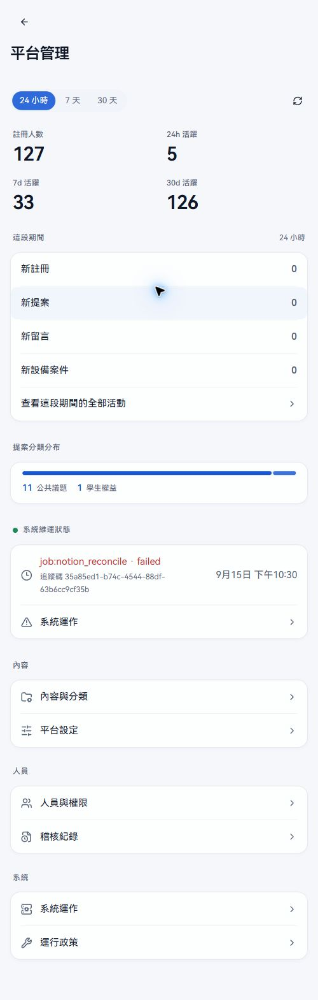

## 平台管理員：總覽

1. 在「平台管理」切換 **24 小時／7 天／30 天**，右上角可手動重新整理。
2. 上方看已註冊人數與三種活躍人數；「這段期間」顯示新註冊、新提案、新留言、新設備案件。可點有數字的項目查看對應活動，或按「查看這段期間的全部活動」前往稽核頁。
3. 「提案分類分布」看各分類案件量；「系統維運狀態」看背景工作、投遞與失敗訊號。發現失敗再進「系統運作」查看，不必在總覽直接改設定。
4. 下方按責任分為「內容」（內容與分類、平台設定）、「人員」（人員與權限、稽核紀錄）、「系統」（系統運作、運行政策）。

平台管理員的「設定」另有本裝置的 **留言通知、提案更新、設備更新** 三個開關；它們只調整平台管理員自己的通知偏好，不會替其他人開關推播。

## 平台管理員：內容與分類

從總覽按「內容與分類」，上方切換「提案／設備／公告」。變更先留在草稿；頁面顯示未儲存項數後，按「儲存」才送出。按「捨棄」回復上次載入的值。若操作會改到既有案件，儲存前會先估算影響筆數並顯示確認畫面，確認後才排入背景工作。

### 提案分類：新增、修改、預設與刪除

1. 在「提案」頁先看「提案功能」開關。關閉時提案入口會從導覽隱藏；原有分類和資料仍保留。重新開啟後才可繼續使用。啟用提案功能時，至少要有一個有效分類，而且只能有一個預設分類。
2. 按既有分類可修改名稱、預設分類、是否允許作者刪除、留言及附議規則。已儲存的分類**識別碼不能改**。識別碼須用小寫英數與中間連字號，不能重複；名稱不可空白，後端上限 40 字。
3. 按「新增提案分類」會先新增一筆**未儲存草稿**。打開草稿填名稱與識別碼，再設定閱讀權限、作者顯示、留言及附議。附議打開時，門檻與天數都必須是正整數，否則「儲存」不可用。
4. 按「預設分類」把新提案預先選到該分類。預設分類不能刪；要刪它，先指定另一個預設分類並儲存。
5. 按「刪除分類」先看到永久刪除警告；確認後**仍只是放進變更草稿**，最後按頁面「儲存」才真正執行。既有分類刪除會連同該分類的提案、留言、附議、通知及上傳圖片一併刪除，不能復原。按「取消」可離開警告，按「捨棄」可取消尚未送出的草稿。

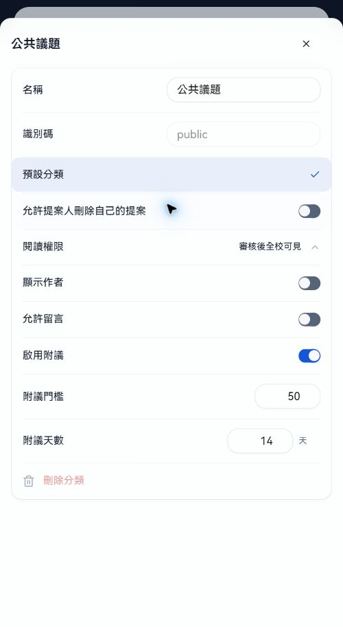

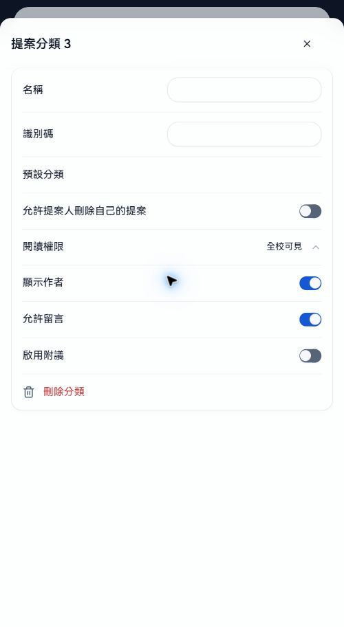
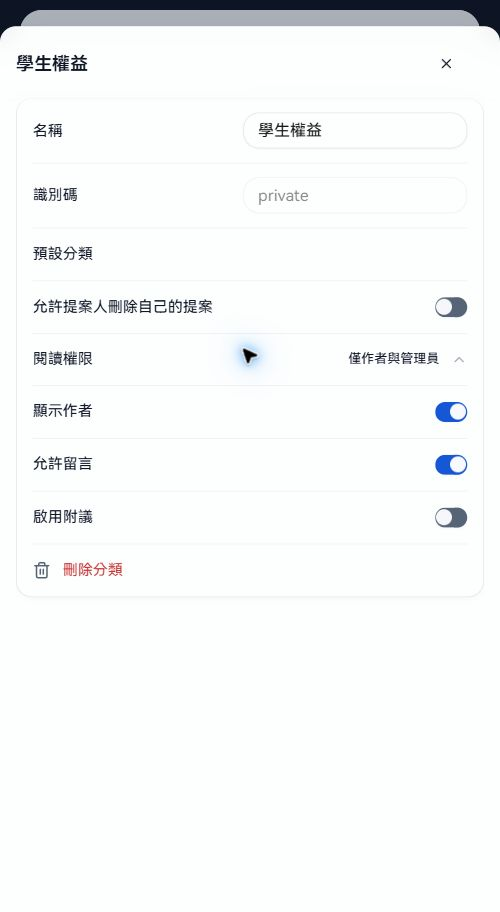

**閱讀權限與作者顯示的組合**

- **全校可見**：提案送出後可被全校瀏覽；沒有先行審核。若啟用附議，期限從建立時開始計算。
- **審核後全校可見**：新提案先進「待審核」，此時作者與該分類管理員能看；審核通過後才公開。審核未通過仍不公開。若啟用附議，通過審核時才開始計算期限。
- **僅作者與管理員**：始終只供作者與該分類管理員閱讀，不走公開列表。後端會強制作者可見；把它設為隱藏作者也不會形成「對管理員匿名」的案件。
- 對前兩種閱讀權限，「顯示作者」關閉後一般讀者看不到作者身分；作者本人與有權限的管理員仍可辨識案件。**已建立分類的閱讀權限與作者顯示是固定政策**：畫面仍可操作控制項，但後端儲存會拒絕。要用新的隱私政策，應建立新分類並安排轉換，不能假設修改畫面就生效。

**留言、附議、作者刪除的組合**

- 「允許留言」關閉，該分類既有提案會由背景工作停止接收新留言；重新開啟時，手動結案或已完成／無法執行／審核未通過的案件仍維持關閉。公告留言也用相同的背景套用流程，但不屬於提案分類。
- 「啟用附議」只決定**新提案**是否有附議與門檻、期限；修改門檻或天數也只影響之後建立的提案，既有提案保存建立時的數值。作者送出時已自動計入 1 人。達標後仍可在截止前繼續附議；未達門檻且到期會轉「未達門檻」。僅作者與管理員可見的分類即使開啟附議，也沒有公開讀者可參與，設定前應確認用途。
- 「允許提案人刪除自己的提案」開啟後，作者也能刪除自己的案件；管理員始終可刪其負責分類的案件。刪除會影響關聯資料，請先核對分類與案件。
- 在提案詳情看到的「顯示作者」是管理員**當次畫面的顯示開關**，不會寫回分類政策，也不會讓其他人的畫面跟著改。

### 設備與公告

「設備」有自己的功能開關、分類名稱／識別碼、預設分類及作者刪除政策。當設備功能關閉時，「新增設備分類」停用；目前學校正處於此狀態。啟用後若要提供設備回報，須先建立至少一個有效分類並選定預設分類。刪設備分類會永久刪除該分類的設備案件與關聯資料。

「公告」頁只有**公告留言**開關，公告本身沒有分類。關閉後既有公告的留言狀態由背景工作更新；發布公告的權限仍由「公告管理」範圍控制。

## 平台管理員：平台設定

在「平台設定」切「資料保留／圖片上傳」。每個數值都是平台政策，不是個人偏好；修改先成草稿。資料保留會影響清理工作，儲存前若估算到既有資料，會列出影響筆數，再要求確認。已啟用的清理開關才顯示其保留期限。

- **內容生命週期**：已結案提案、已結案設備案件、舊公告、舊通知，各有清理開關及天數。
- **帳號與隱私生命週期**：閒置空帳號頭像、閒置帳號個人資料、到期互動限制，以及推播裝置保留和重新確認間隔。
- **系統運作紀錄**：已完成／失敗投遞、操作紀錄、事件紀錄、已完成／失敗背景工作。
- **稽核歷史**：角色指派、平台管理活動、分類設定、存取指派各自的保留天數。
- **上傳生命週期**：待上傳、未附加、失敗上傳資料的保留小時。

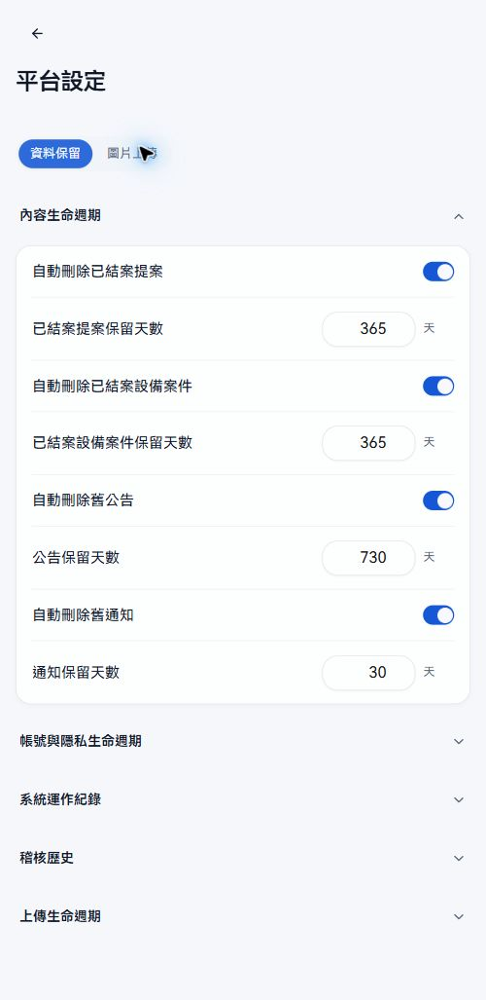
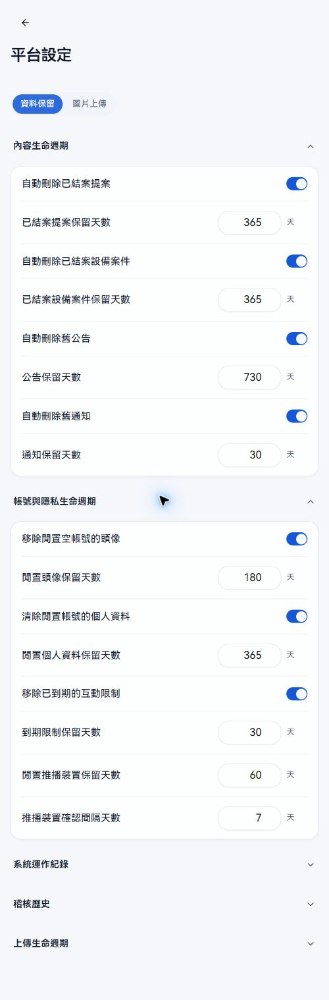
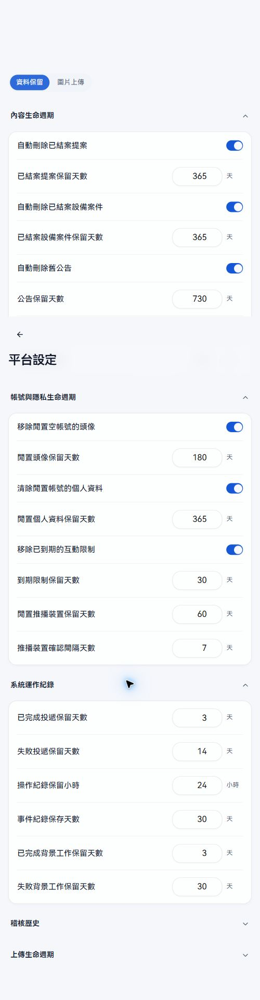
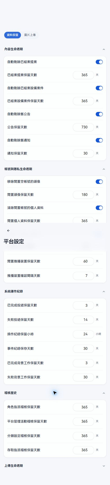
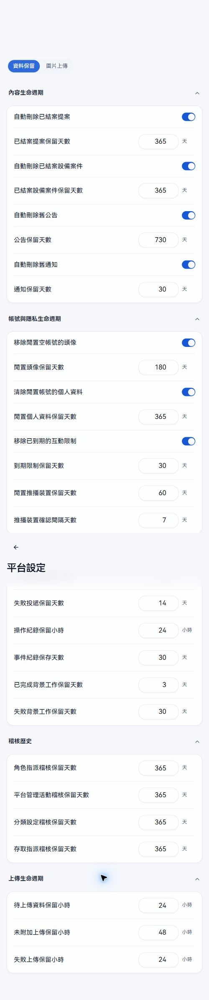

「圖片上傳」分成每則提案、設備案件、公告、留言可附的圖片張數，以及圖片上傳後大小上限、最長邊和 WebP 品質。畫面目前分別顯示提案 2、設備 2、公告 10、留言 1 張；上傳後上限 800 KB、最長邊 2000 px、WebP 品質 0.82。這些是目前設定，往後請看頁面即時值。

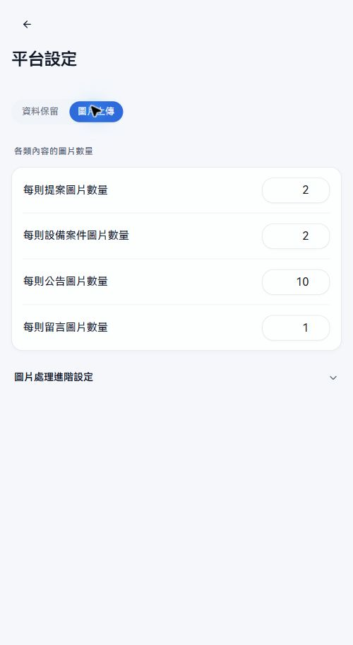
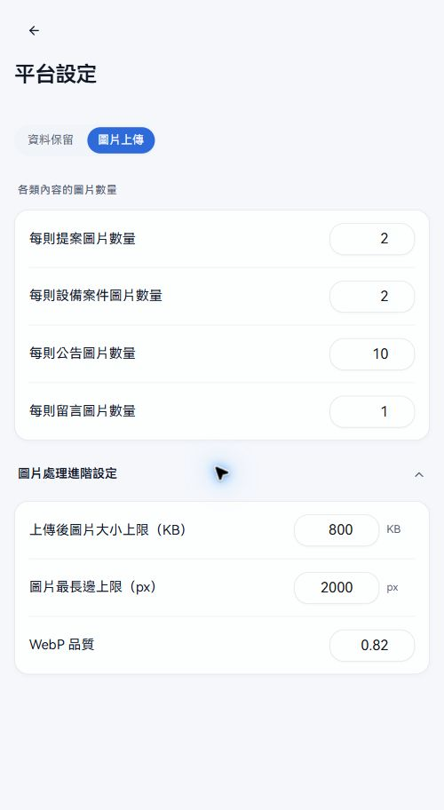

## 平台管理員：人員與權限

此頁有「依帳號／依範圍／限制規則」。**只有已註冊且至少登入過 Novae 的人能在帳號搜尋中找到。**

### 依帳號

1. 輸入姓名、校內信箱或 UID，按「搜尋」。
2. 開啟帳號可查看 UID、註冊時間、目前授權範圍及有效的互動限制。畫面可能顯示學號、姓名與信箱；對外分享截圖時先遮蔽。
3. 若要替**單一帳號**限制互動，在帳號詳情選存取模式、期限並填要給該使用者看的原因；套用後同頁能看實際生效規則及來源。若個別 UID 規則已存在，可在此清除或替換。

### 依範圍指派負責人

1. 先選「提案分類／設備分類／公告管理」。提案與設備還要選具體分類；公告管理沒有分類選單。
2. 查看目前負責人。按其右側撤銷圖示可先把撤銷加入草稿。
3. 在「尋找並指派成員」輸入校內信箱、姓名或 UID，按搜尋。找到候選人後按指派；已在範圍內的帳號會顯示已授權，不必重複新增。
4. 最下方檢查未儲存變更，按「儲存」送出。按「捨棄」取消草稿。重新進入該範圍確認名單，並用受指派帳號核對實際可管理的分類。

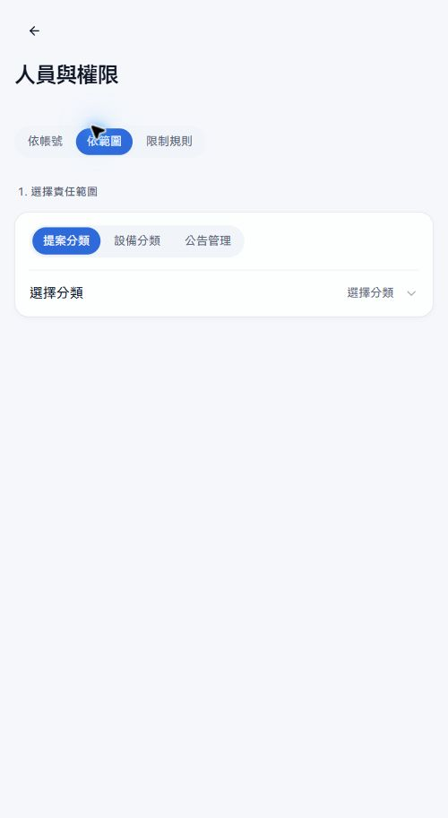

### 限制規則與三種模式

「限制規則」可新增**學校信箱 @ 前的帳號前綴**，持續套用到現在和未來符合的帳號；單一 UID 規則優先於前綴規則。前綴規則可編輯或刪除。平台管理員不受互動限制，身分也不是在此頁指派。

- **唯讀**：可讀取允許的內容，不能新增、留言、上傳或附議／按讚等反應。
- **僅可附議、按讚與標記「我也遇到」**：不能新增、留言或上傳，仍可做上述反應。
- **完全封鎖**：受保護的請求會直接被拒絕，登入流程也可能顯示限制原因。

新增或修改規則時，先填前綴或目標 UID，再選模式、期限 **7 天／30 天／自訂／永久**，最後填「限制原因／顯示訊息」後套用。原因不可留白；自訂期限須填時數。前綴在建立後不能改成另一個前綴，需另建規則。正式套用前先核對符合帳號數，避免前綴過短波及無關人員。

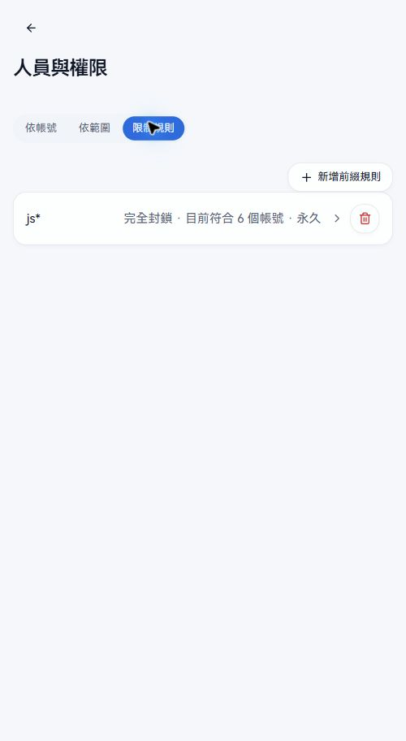

## 平台管理員：稽核與系統

「稽核紀錄」切「管理動作／平台活動」。管理動作可搜尋並開啟一筆，看執行者、時間、操作、目標與細節；平台活動看指定期間的內容與帳號活動。刪除提案、更新狀態、改分類、指派權限與調平台設定都會留下管理稽核。若由總覽的活動項目進入，會帶到相應的活動清單。

「系統運作」分三頁：

1. **失敗與重試**：查看排隊中或卡住的背景工作、投遞狀態及 Worker 錯誤。失敗工作可開詳情後單筆重試，或按整批重試；Worker 錯誤紀錄只是請求錯誤統計，不能在該列重試原請求。右上可重新整理。
2. **Notion 封存完整重建**：按「排程重建」先讀確認視窗；重建會把目前資料庫中的內容、狀態、時間、留言與系統維運紀錄重新寫入 Notion。舊的 Notion 同步佇列、失敗紀錄及上一輪重建會清掉；其他通知佇列不受影響。既有 Notion 頁面不會自動刪除，背景工作會分批顯示進度。
3. **清除所有排程／清除所有 Worker 錯誤**：各有獨立確認視窗。清排程會停止目前等待、執行、失敗的背景工作並清掉外部刪除待辦；已完成歷史與之後新增的工作不受影響。清 Worker 錯誤會清掉目前錯誤統計。這兩個按鈕解決的問題不同。
4. **容量**：看資料庫總量、最近歷史樣本和前六大資料表；「全部」打開所有資料表，顯示列數、待清版本與大小。
5. **外部服務**：Cloudinary 與 Cloudflare Workers 統計可重新整理，並開「原始回應內容」；Worker 紀錄要用追蹤 ID 或事件關鍵字搜尋，不會自動列出完整日誌。

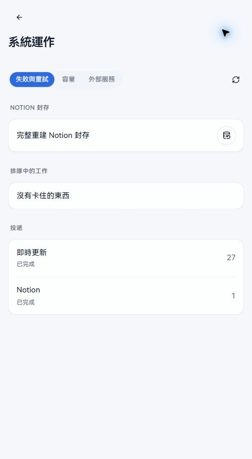
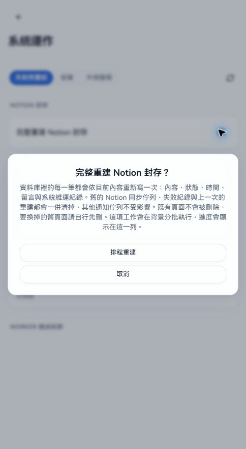
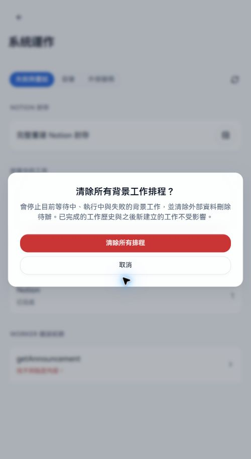
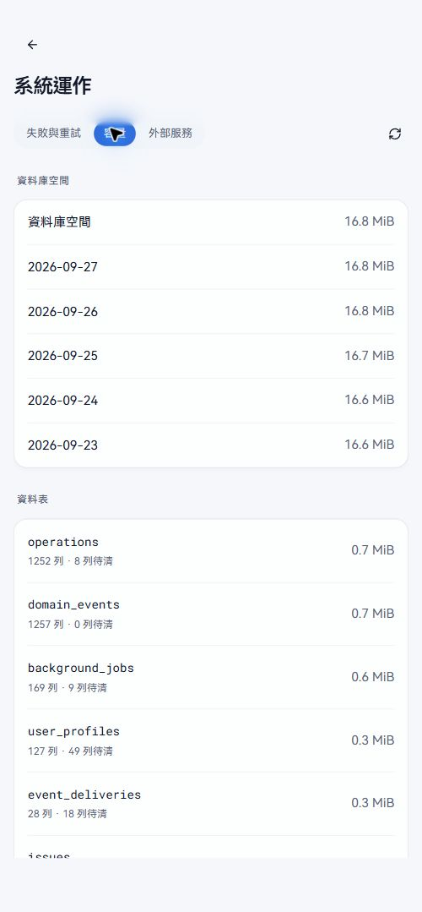
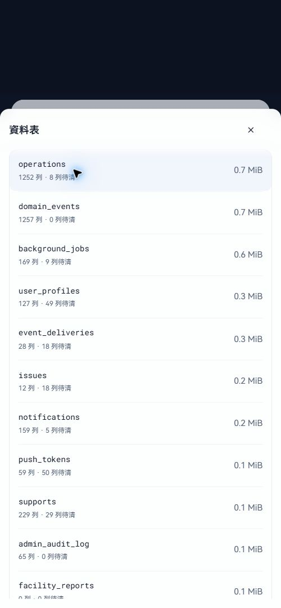
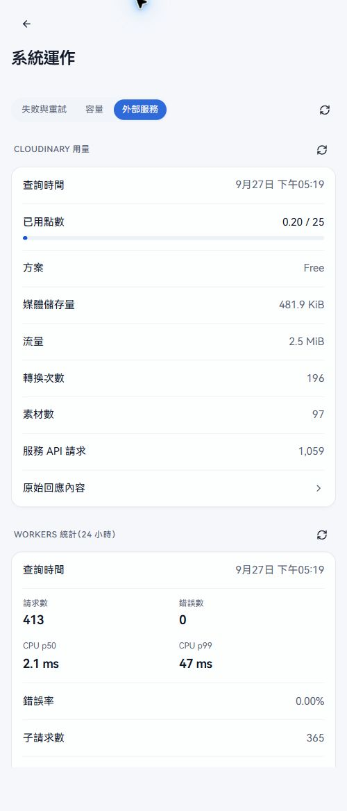

## 平台管理員：運行政策

「運行政策」控制請求與背景工作的實際限制。先選類別、改數值，底部會出現未儲存變更與**變更原因**欄位；原因填妥才能儲存。每次成功修改會產生新的 revision，從「設定修改紀錄」查看前後差異與原因。

- **內容**：提案／公告標題、內文、留言、處理結果、設備地點及搜尋字串長度。
- **配額**：每 10 秒讀取、一般寫入、敏感寫入、管理操作、圖片寫入／解析，以及每日或每小時提案、設備、公告、留言、圖片、附議、狀態修改等限額。數字是每位使用者或對應工作類型的限制，改之前先確認單位。
- **進階 → 紀錄保存**：Notion 非內容事件封存、錯誤與統計保存。
- **進階 → 前端請求與節流**：頁面快取時間與筆數、列表保留、公開圖片快取、頭像重查、重複操作冷卻、不同請求逾時與自動重試。
- **進階 → 工作批次**：Notion、通知、即時同步、外部工作及政策清理每批筆數。
- **進階 → 即時連線**：連線憑證有效期；相關心跳與閒置斷線設定也在進階請求分組中。

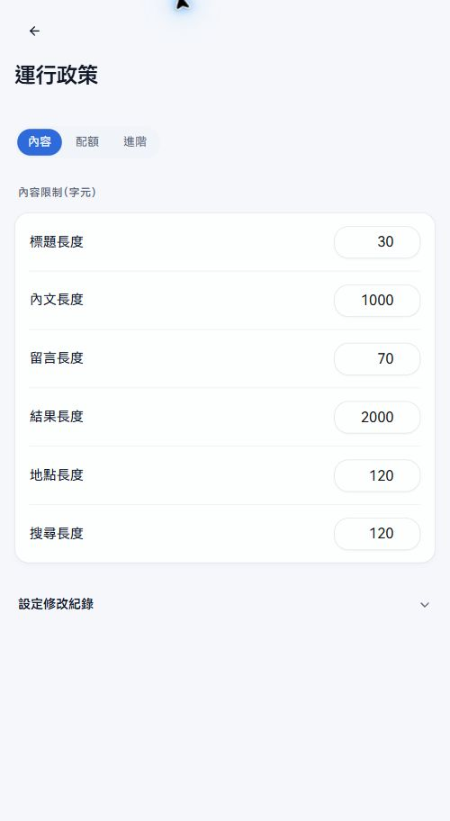
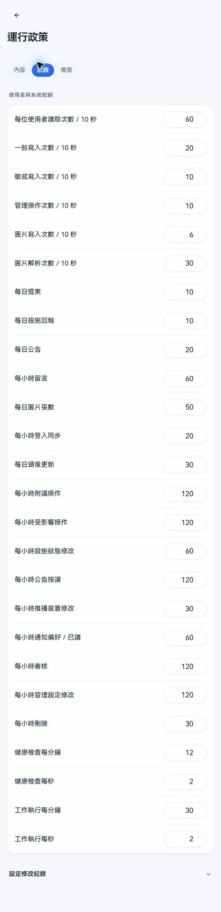

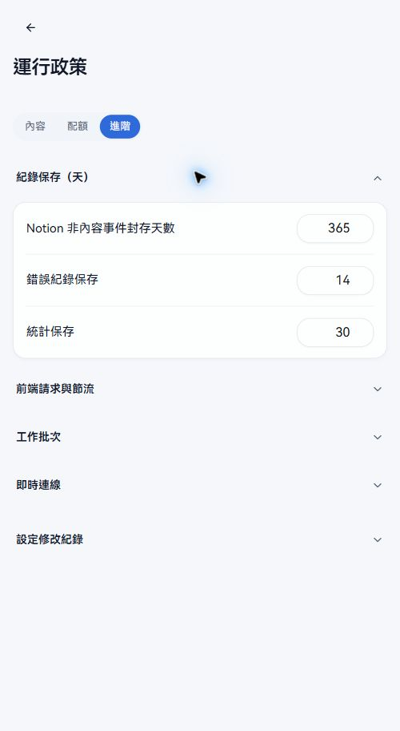
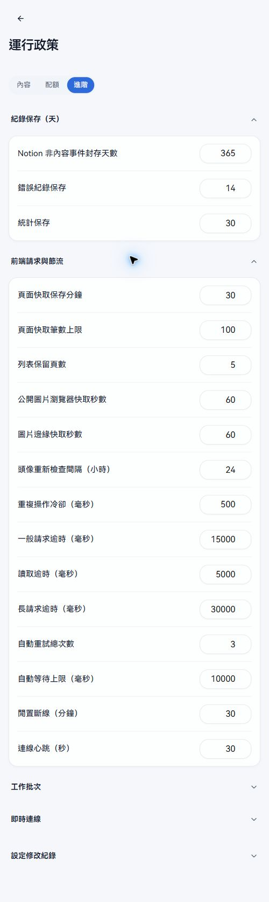
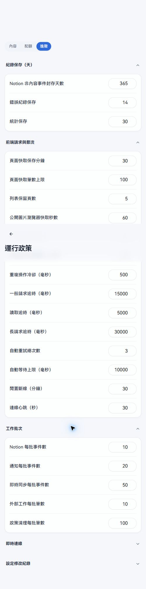
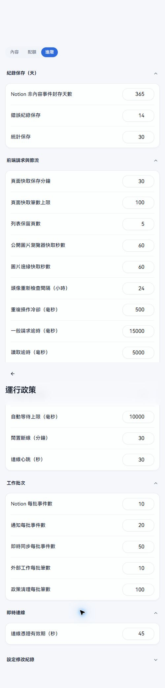

## 提案分類管理員：案件操作

先從「提案 → 選擇分類」切到受指派分類，再用「進行中／已結案」、搜尋及排序找案件。排序提供最新、最多附議與即將截止。管理員只對**自己被指派的分類**取得管理操作；平台管理員可跨分類。提案作者仍可從「我的提案」找自己的私密或待審核案件。

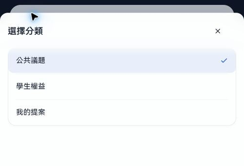

### 審核後全校可見：審核通過或退回

1. 在該分類的「進行中」找到「待審核」提案。開啟詳情，確認標題、內容、分類及作者；此階段一般學生看不到案件內容。
2. 右上「更多操作 → 管理狀態」。選「通過審核」再按「送出」，提案公開；若有附議，從通過時開始計算期限。選「不通過審核」時，必須填**不通過原因**，送出後仍只供作者與管理員查看。
3. 審核未通過的案件仍可由管理員再次開「管理狀態」並改為通過；不要為了修正錯誤另複製同一案件。
4. 審核中的提案留言不開放；退件後也不開放。若需向作者說明，退件原因要寫清楚。

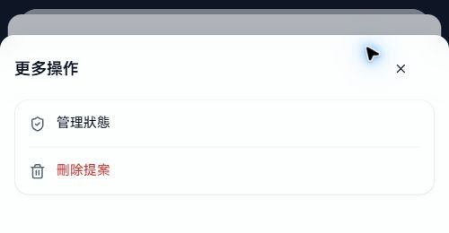

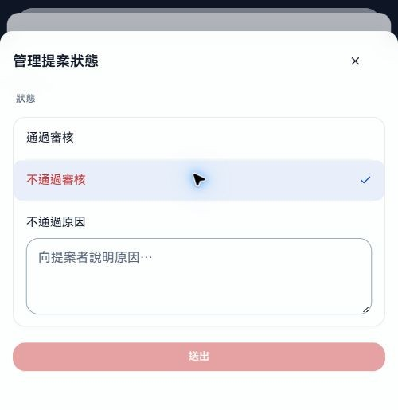

### 公開後：處理、結案與無法執行

1. 開提案詳情，看狀態、附議進度和時間軸。有附議的案件，作者送出時已計 1 人；作者不能再按附議。作者或該分類管理員可開「附議者」檢視名單。
2. 右上「更多操作 → 管理狀態」。處理階段可選「處理中」、「已完成」、「無法執行」。從尚未回覆的案件進入表單時，會先選「處理中」。
3. 選「已完成」或「無法執行」都必須填**處理結果**才可送出；結果會出現在提案詳情。選「處理中」時不要求結果，原有結果若存在會被清掉。
4. 已完成／無法執行的案件列在已結案，留言與附議不再新增。若附議開啟但期限到了仍未達門檻，系統會轉成「未達門檻」；達門檻後可進後續處理，但截止前仍能繼續附議。
5. 「更多操作 → 刪除提案」會刪案件與相關紀錄；先核對案件 ID／分類。一般作者能否刪自己的提案由該分類的作者刪除政策決定。
6. 有留言功能且案件允許留言時，管理員可在下方回覆作者、刪除不適當留言。留言可切換新到舊／舊到新；回覆會保留對象。沒有開啟留言、審核中、退件或結案時，輸入區不會提供可用的新留言操作。

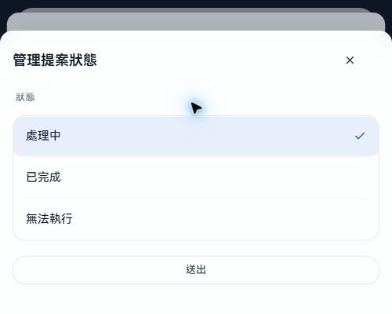
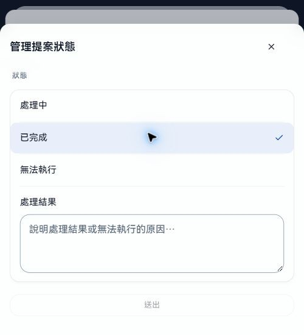
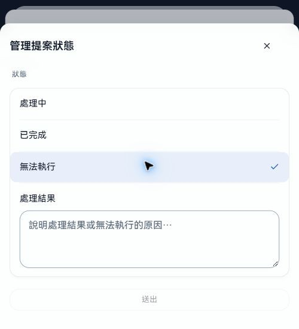

### 私密分類與作者顯示

「學生權益」目前是**僅作者與管理員**、不附議、允許留言。作者送出後不會出現在其他學生的列表；管理員在被指派的分類檢視，直接留言對話並按上段方式更新處理狀態。因為此分類沒有審核流程，不會出現「通過審核／不通過審核」選項。詳情的「顯示作者」只控制管理員當前畫面，與分類建立時的公開作者政策不同。

## 設備分類管理員與公告管理員

設備功能目前關閉，所以無法在正式站拍到設備案件狀態表單。以下流程依目前前後端程式碼核對，啟用後應再用正式畫面複核：設備分類管理員在受指派分類開啟設備案件，可看標題、地點、內容與「我也遇到」情況；透過管理狀態改成**處理中／已完成／無法處理**。後兩者要填處理結果。管理員可刪該分類案件；作者能否刪由設備分類的作者刪除開關決定。前端狀態選單另列「待處理」，但目前後端狀態更新只接受上述三種，故不能把「待處理」當成可成功送出的回退動作。

公告管理員到「公告」按右上「新增公告」，填標題與內容，可加圖片；工具列有標題、粗體、斜體、清單、連結及更多格式。文字草稿在本分頁保留最多 24 小時，離開後圖片要重新選取，登出會清除草稿。按「發布公告」後對所有有閱讀權限的使用者顯示；在既有公告詳情的「更多操作」可刪除。公告按讚是一般讀者也可做的反應；留言能否使用取決於平台的公告留言政策，具公告管理權限者可刪除公告留言。公告管理權限不包含提案與設備分類管理。

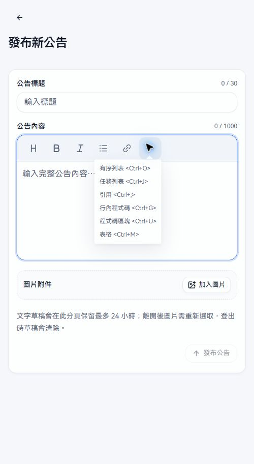

## 最容易混淆的組合

- **同一個人同時管 A、B 兩個提案分類**：能處理 A、B 的案件；不能處理未指派的 C；不因此能改 A、B 的分類政策。
- **管提案分類又有公告管理權限**：兩套操作都能用；公告不分提案分類。只有取得平台管理權限，才能改全域公告留言開關。
- **審核後公開 + 隱藏作者 + 附議**：審核前只有作者與管理員可見；通過後一般讀者可看內容、附議，但不看作者；管理員仍能核對作者及附議者。
- **私密分類 + 留言 + 無附議**：作者與管理員對話處理，不走公開附議；目前「學生權益」就是這組設定。
- **關閉提案或設備功能**：入口會隱藏，資料與分類不會因功能開關被刪；「刪除分類」則會刪掉其下資料，兩者後果不同。
- **改既有分類的隱私選項**：畫面可點但後端拒絕儲存；新分類建立時就要決定閱讀範圍與作者顯示。其他如附議門檻變更只影響新提案，留言政策會排背景工作處理既有案件。
- **調平台設定與調運行政策**：前者管保留和圖片；後者管請求、配額、背景批次與即時連線。兩頁各自儲存，運行政策必填變更原因。

## 程式碼核對與限制

本手冊核對了管理路由與權限表、前端分類編輯器／草稿保存、提案與設備狀態表單、後端 action 權限與資料庫政策。主要檔案包括 `src/lib/admin-routes.ts`、`src/lib/session-access.ts`、`src/components/admin/`、`src/components/issues/issue-moderation-sheet.tsx`、`src/components/facilities/facility-status-sheet.tsx`、`cloudflare/src/backend/actions/auth.ts`、`cloudflare/src/backend/actions/categories.ts`、`cloudflare/src/backend/actions/issue-moderation.ts`、`cloudflare/src/backend/actions/facilities.ts`、`database/migrations/0044_category_author_deletion_policy.sql`、`database/migrations/0045_review_timestamp_reset.sql`。正式站未啟用設備，也沒有可供拍攝的私密提案與公告，因此這幾項只提供現場入口畫面與程式碼核對後的操作說明；沒有把假畫面當成實拍。
