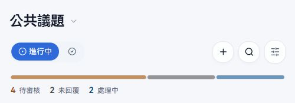
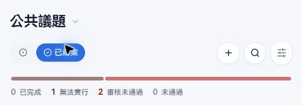

# Novae 分類管理員｜提案與設備操作

這頁給**只拿到指定提案或設備分類權限**的管理員。權限按分類計算：被指派 A、B，就能處理 A、B 的案件；C 沒有指派，即使拿到連結也不能管理。分類管理權限不包含新增分類、修改全校政策、人員指派、稽核或系統設定。平台總管理員則能處理所有分類，其他平台操作見[平台總管理員操作手冊](platform-admin.md)。公告管理是另一種獨立權限，不隨提案或設備分類權限附送。

## 從哪裡找案件

從主導覽進「提案」，按上方「選擇分類」切到被指派的分類。可切「進行中／已結案」，用搜尋或排序找案件；排序有最新、最多附議、即將截止。管理員能看到自己負責分類的待審核和私密案件，一般學生看不到這些案件的內容。作者自己的案件則可從「我的提案」找回。

## 提案到底有幾種狀態？

提案共有 **7 種狀態**。列表的「進行中」放 3 種；「已結案」放 4 種。審核、附議、管理員處理是不同階段，不能把「未回覆」理解成附議已達標，也不能把兩種「未通過」混成同一個原因。

### 進行中：3 種

1. **待審核**（`under-review`）：只在「審核後全校可見」的分類建立新提案時出現。作者與該分類管理員可看，其他學生看不到內容；此時不開放附議與留言。管理員可通過或退件。
2. **未回覆**（`pending`）：全校可見或私密分類送出後直接進入；審核後公開的案件則在通過審核後進入。意思是案件開放、尚未進入「處理中」，**不是**附議已達標，也沒有一個固定的管理員回覆期限。若該案件有附議，仍可在期限內累積人數；若允許留言，作者與有閱讀權限的人可留言。
3. **處理中**（`processing`）：管理員選「處理中」會進入；啟用附議的提案達到門檻時也會自動轉入。代表案件進入處理流程，尚未結案。原附議期限未到時仍可繼續附議；達標紀錄不會因有人取消附議就自動倒退。留言是否開放仍看分類政策與案件設定。

### 已結案：4 種

4. **已完成**（`completed`）：管理員表示已處理完成，送出時必須填「處理結果」。不再接受新附議或留言；結果留在提案詳情。
5. **無法實行**（`infeasible`）：管理員表示無法執行，送出時也必須填清楚處理結果或原因。狀態徽章寫「無法實行」，管理表單選項寫「無法執行」，指的是同一個狀態。
6. **審核未通過**（`review-rejected`）：審核階段退件，必須填「不通過原因」。此案不會公開，也不接受附議或留言；作者與管理員仍可查看。管理員日後可重新審核並通過。
7. **未通過**（`auto-rejected`）：這是**附議期限到時仍未達門檻**，與「審核未通過」不同。只會發生在啟用附議、案件仍為未回覆、門檻未達且期限已到的情況。畫面可能先依期限顯示「未通過」，背景工作再寫入正式狀態；不會因一般人按鈕而重新開始附議。

典型路徑是「待審核 → 未回覆 → 處理中 → 已完成／無法實行」。另有兩條分支：待審核可退成「審核未通過」；未回覆若附議期限到且未達標，可變「未通過」。**不須審核的分類從未回覆開始**；不啟用附議的案件不會因附議期限變「未通過」。

## 不同分類政策會讓流程怎麼變

- **全校可見**：送出即「未回覆」並可公開閱讀；有附議時期限從建立時間起算。
- **審核後全校可見**：送出是「待審核」；通過後才公開並變「未回覆」。有附議時，期限從通過審核起算；退件後不公開。
- **僅作者與管理員**：送出即「未回覆」，但只有作者與該分類管理員能讀；其他學生沒有公開列表入口。目前「學生權益」就是這種分類，且未啟用附議、允許留言。
- **顯示作者關閉**：對全校讀者隱藏作者身分，作者本人與管理員仍可辨識。私密分類的後端會強制顯示作者；提案詳情右上的「顯示作者」只是管理員當前畫面的切換，不會修改分類政策。
- **留言關閉**：不能新增留言。審核中、審核未通過及已結案案件即使分類允許留言，也不提供新留言。分類留言政策變更可能透過背景工作套用到既有案件。
- **附議關閉**：沒有附議進度、門檻、期限，也不走「未通過」分支。附議開啟時作者送出已算 1 人，作者不能再按一次；一般人可於期限內附議或取消。只有作者與管理員能開「附議者」名單。
- **允許作者刪除**：作者才會有刪自己案件的權限；被指派的管理員不受這個開關限制，可以刪自己負責分類的案件。刪除是實際資料操作，先核對分類與案件。

這些設定由平台總管理員建立分類時決定。分類管理員只能依既有政策處理案件，不能改閱讀範圍、門檻或留言開關。

## 公共議題：審核一筆新提案

1. 切到「公共議題 → 進行中」，找標示「待審核」的提案。點進去讀標題與內文，確認內容是否適合公開。此時附議按鈕不可用。
2. 右上按「更多操作 → 管理狀態」。選「通過審核」並按「送出」後，案件變「未回覆」且開始公開；目前公共議題的附議門檻為 50 人、期限 14 天，期限從這次通過時間算起。
3. 若不適合公開，選「不通過審核」，填**不通過原因**再送出。空白原因不能送出；退件後作者與管理員仍能看，其他學生看不到。
4. 若退件後要重新通過，從「已結案」找「審核未通過」的案件，再開「管理狀態」選通過。通過時會重新設定審核通過時間與附議期限。

## 公開後：接手、結案、重新處理

1. 在提案詳情看狀態、附議進度、時間軸與留言。若有附議，達門檻會自動轉「處理中」；管理員也能從「未回覆」手動選「處理中」。
2. 右上「更多操作 → 管理狀態」可選「處理中」、「已完成」、「無法執行」。選後兩者一定要填**處理結果**才可送出；選「處理中」不需要結果。
3. 已完成或無法實行後，案件放在「已結案」，不再接受新留言與附議。若管理員重新選「處理中」，系統會清掉舊結果並回到進行中。
4. 對「未通過」的案件，管理選單也會提供處理階段選項；但原附議期限不會因此重新起算。若是要重新蒐集附議，不能把「改成處理中」當成重開附議。
5. 啟用留言且案件可留言時，可在詳情下方回覆作者、切換新到舊／舊到新，或刪除不適當留言。按某則留言的「回覆」會保留回覆對象；目前輸入框只接受文字。
6. 「更多操作 → 刪除提案」會刪掉案件與關聯資料；這與改為已完成或無法實行不同。刪除前先核對案件。

## 私密分類：與作者對話

「學生權益」目前只供作者與該分類管理員閱讀，不走公開審核或附議。作者送出後直接是「未回覆」；管理員在此分類找案件，透過留言補問資料、回覆作者，必要時改「處理中」，最後選「已完成」或「無法執行」並填結果。分享到別人手上的連結不會自動給對方閱讀權限。

目前正式站的這個分類沒有可供展示的進行中案件，下面是實際空列表；操作規則依現行程式碼核對，沒有用假資料充當截圖。

## 設備分類管理員

設備權限同樣按分類指派。設備功能目前關閉，因此正式站沒有可拍的設備案件；開啟後，管理員只處理自己負責分類的回報。設備案件共有 **4 種狀態**：

1. **待受理**（`pending`）：使用者剛送出；可查看標題、地點、內容與「我也遇到」人數。
2. **處理中**（`processing`）：管理員接手後選此狀態。後端只允許從「待受理」進到「處理中」。
3. **已完成**（`completed`）：從「處理中」結案，必填處理結果。
4. **無法處理**（`unable-to-handle`）：從「處理中」結案，必填無法處理的結果或原因。

兩種結案狀態都放「已結案」，也不能再標記「我也遇到」。前端狀態表單雖列出「待受理」，目前後端不接受把已進入處理中的案件退回待受理，也不接受直接從待受理跳到結案。管理員可刪自己負責分類的案件；作者能否刪自己的案件，由該分類的作者刪除政策決定。

