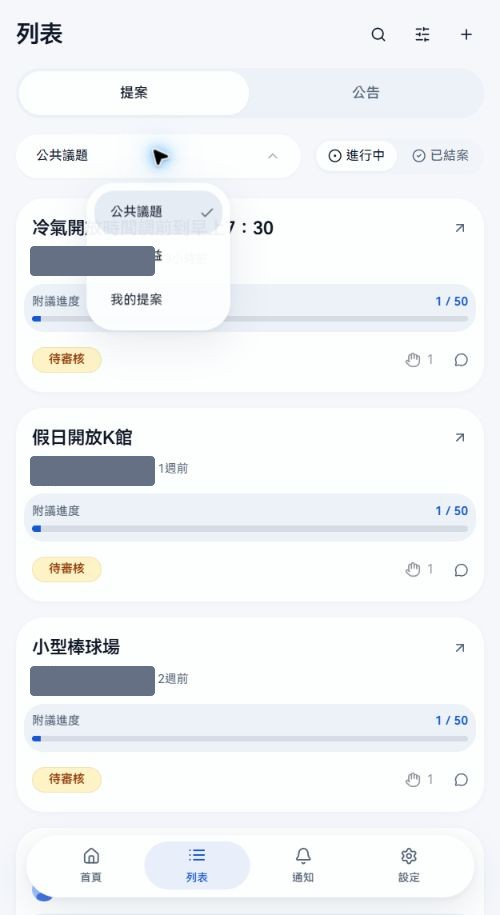
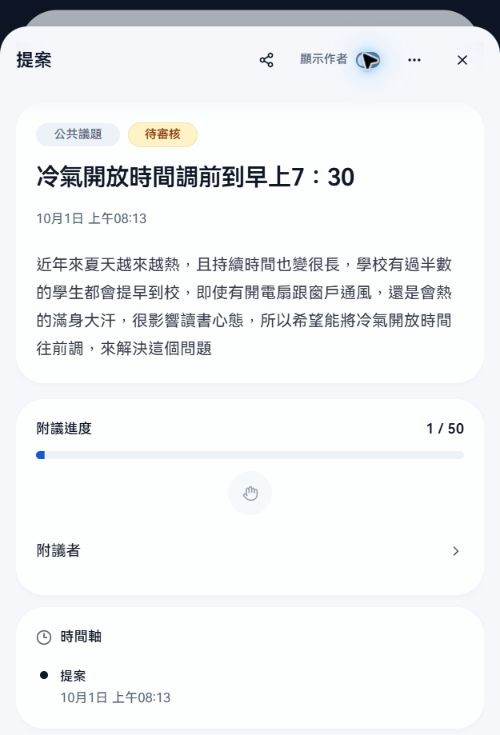
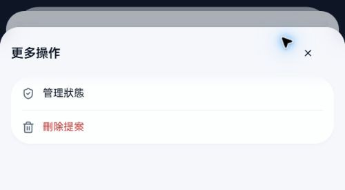
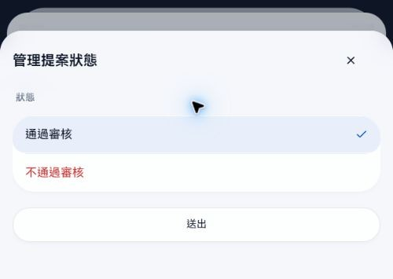
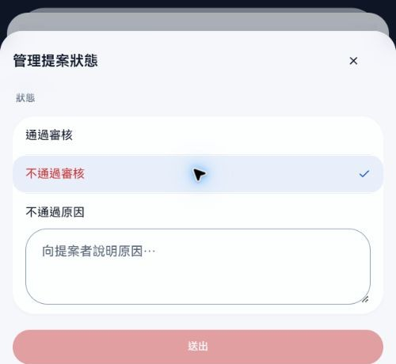
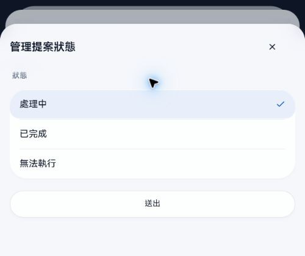
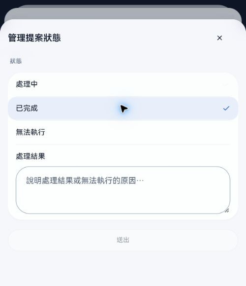
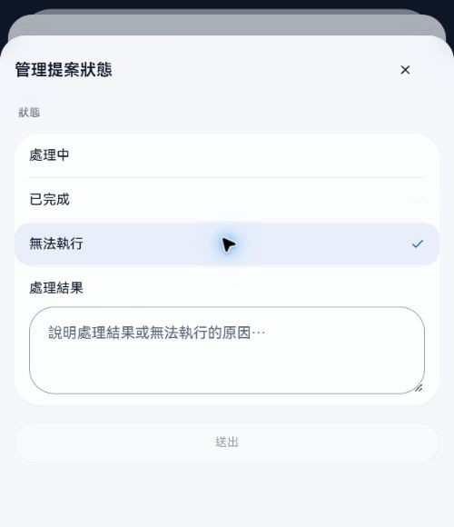
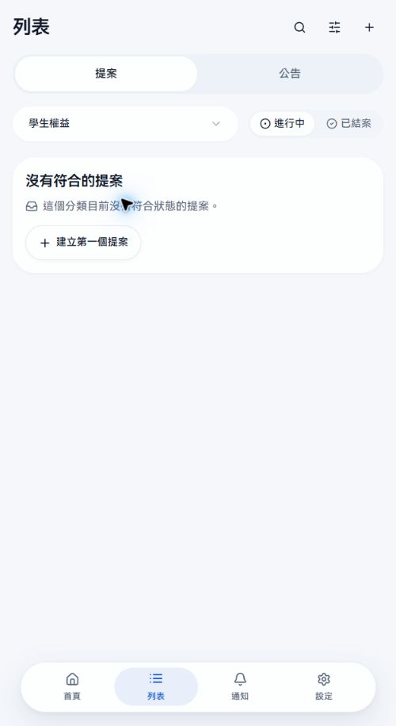

# Novae 分類管理員｜提案與設備操作

更新日期：2026-10-01。操作路徑依新版正式站整理；設備部分為尚未啟用時的預備說明。

這份手冊給只取得指定提案或設備分類權限的管理員。被指派哪些分類，就能處理那些分類的案件。平台總管理員可處理所有分類，平台設定與人員授權見[平台總管理員操作手冊](platform-admin.md)。

## 權限範圍

| 身分 | 可做的事 |
| --- | --- |
| 提案分類管理員 | 閱讀負責分類的公開、待審核與私密案件；審核、更新處理狀態及刪除該分類案件。 |
| 設備分類管理員 | 功能開放後，處理負責設備分類的案件。 |
| 公告管理員 | 發布及刪除公告；此權限須另外指派。 |
| 平台總管理員 | 處理所有分類，並管理分類規則、平台設定、人員權限、稽核與系統。 |

分類管理權限不包含新增分類、修改全校政策或替其他人指派權限。拿到未授權案件的連結，也不會增加管理權限。

## 新版介面：從列表找案件

1. 按主導覽「列表」，再選上方「提案」分頁。手機主導覽在底部，電腦在左側。
2. 按分類選單，切到負責的分類。
3. 在「進行中」找待審核、未回覆及處理中的案件；在「已結案」找已完成、無法實行、審核未通過與未達附議門檻的案件。
4. 右上放大鏡可搜尋，旁邊排序圖示可切最新、最多附議、即將截止。
5. 點案件開啟詳情，按右上「關閉」回列表。

管理員可看負責分類的待審核與私密案件，所以列表可能比一般學生多。作者的案件也可從「我的提案」找回。首頁的「整體近況」顯示統計，並不是待辦案件清單。

搜尋短關鍵字時先篩目前已載入的資料，至少 3 個字才查詢更多結果；查不到時檢查分類、進行中／已結案及搜尋條件。

## 提案的七種狀態

列表徽章、管理表單和其他摘要有少數用字不同。下表以案件階段說明，同一階段的不同名稱列在一起。

| 列表 | 狀態與可能用字 | 進入方式及後續 |
| --- | --- | --- |
| 進行中 | 待審核／審核中 | 需要審核的分類送出新案。作者與分類管理員可讀，尚未公開。管理員選通過或退件。 |
| 進行中 | 未回覆／待處理 | 不需審核的案件送出，或審核通過。案件尚未進入處理中；啟用附議時可能仍在累積人數。 |
| 進行中 | 處理中 | 管理員手動接手，或附議達標自動轉入。接著可完成或判定無法執行。 |
| 已結案 | 已完成 | 管理員結案，必須填處理結果。 |
| 已結案 | 無法實行／無法執行 | 管理員判定無法執行，也必須填處理結果。 |
| 已結案 | 審核未通過 | 審核退件，必須填不通過原因。仍只供作者與管理員閱讀；日後可重新審核。 |
| 已結案 | 未通過／未達門檻 | 附議到期而未達標。只發生在啟用附議、仍為未回覆、期限已到且尚未達門檻的案件。 |

典型流程為「待審核 → 未回覆 → 處理中 → 已完成／無法實行」。審核退件和附議未達標是不同分支。

「未回覆」沒有固定的管理員回覆期限，也不表示附議已達標。附議達標後有人取消附議，案件不會自動退回未回覆；時間軸仍保留曾達標的紀錄。

## 分類規則如何影響流程

### 閱讀權限、作者顯示

| 分類設定 | 新案起始狀態 | 可閱讀的人 | 附議期限起算點 |
| --- | --- | --- | --- |
| 全校可見 | 未回覆 | 全校已登入且有存取權限的使用者 | 建立時間 |
| 審核後全校可見 | 待審核 | 通過前為作者與分類管理員；通過後全校可讀 | 審核通過時間 |
| 僅作者與管理員 | 未回覆 | 作者與分類管理員 | 依此分類是否啟用附議；本校學生權益未啟用 |

公開分類關閉「顯示作者」時，一般讀者不顯示身分，但作者本人與管理員仍可辨識。私密分類會讓管理員能識別作者。

詳情右上的「顯示作者」只切換管理員當前畫面，不會修改分類政策。截圖對外使用時，請遮蔽作者姓名、學號與頭像；關閉顯示作者後，仍要檢查其他區域是否有身分資料。

### 附議、圖片與刪除權限

- 附議開啟時，作者送出已計入 1 人。一般使用者在可附議期間加入或取消；作者自己的按鈕停用。
- 「附議者」名單僅作者與有權限的管理員可看；不要把名單直接放進公開教學圖。
- 原附議期限未到時，處理中的案件仍可能接受附議；已結案則不再接受。
- 不啟用附議的分類沒有人數門檻與附議到期分支。本校學生權益屬於這種情況。
- 每篇內文圖片數由分類規則決定；本校目前公共議題、學生權益各為 2 張。張數規則變更只影響之後新增的圖片，已發布圖片保留。
- 作者自行刪除由分類政策決定；本校目前兩個提案分類都未開放。管理員仍可刪負責分類的案件。

分類管理員依既有規則處理；要改閱讀權限、附議門檻、圖片張數或其他分類政策，請交由平台總管理員。

## 公共議題：審核新提案

本校公共議題採「審核後全校可見」，一般讀者不顯示作者，附議門檻 50 人、期限 14 天。

1. 在「列表 → 提案 → 公共議題 → 進行中」找「待審核」案件。
2. 點進去閱讀標題與內文，確認內容、附件和作者背景是否適合公開。此時附議按鈕不可用。
3. 按右上「更多操作 → 管理狀態」。
4. 選「通過審核」後按「送出」。案件變成未回覆並公開，附議期限從通過時間起算。
5. 如果退件，選「不通過審核」，填「不通過原因」再送出；空白原因不能送出。
6. 回列表或重新開案件，確認新狀態與時間軸。退件仍只供作者與管理員閱讀。

退件原因請寫出具體問題及作者可補正的方向。若之後要重新通過，到「已結案」找「審核未通過」的案件，再開管理狀態選通過；通過時會重新記錄審核通過時間與附議期限。

以上截圖只展示表單，沒有替原案件送出審核結果。

## 公共議題：接手、結案與重新處理

1. 開啟詳情，核對狀態、附議進度與時間軸。達門檻會自動轉「處理中」，管理員也可從未回覆手動接手。
2. 按「更多操作 → 管理狀態」，選「處理中」後送出。
3. 處理完成後，選「已完成」；無法執行則選「無法執行」。兩者都須填「處理結果」，空白不能送出。
4. 結果應交代採取的措施、完成情況；無法執行時寫清楚原因和可行替代方式。
5. 送出後確認案件在「已結案」，詳情顯示正確結果。
6. 如果需要再接手，可重新選「處理中」。系統會清掉舊處理結果，所以請先保存仍需留存的處理說明。

未達附議門檻的案件也會提供處理階段選項，但手動轉處理中**不會重新起算附議期限**。若要重新蒐集附議，不能把改狀態當成重開期限。

## 學生權益：私密案件與作者對話

學生權益只供作者與該分類管理員閱讀，不需公開審核，也不啟用附議。新案直接是未回覆；管理員在此分類找案件，確認背景，向作者補問資料。

1. 開啟案件，確認目前狀態與作者提供的背景。
2. 用底部固定的留言輸入框回覆；按向上箭頭，或 Ctrl／Command + Enter 送出。
3. 針對某一則內容回覆時，按其回覆圖示；上方會保留對象與摘要，避免回錯人。
4. 本校目前每則學生權益留言可附 1 張圖片，可用「加入圖片」提供示意資料。先檢查縮圖再送出。
5. 可切從新到舊／從舊到新，展開留言的回覆。文字草稿暫存在目前分頁，圖片離開後需重新選取。
6. 接手後改處理中，最後選已完成或無法執行，填處理結果並送出。結案後不接受新留言。
7. 需要再處理時可改回處理中；先確認舊結果是否需要另行留存。

分享到別人的連結不會替對方增加閱讀權限。截圖還要檢查內文和附件是否包含當事人的個人資料。

留言開關由平台總管理員決定。若分類關閉留言，案件不提供新增入口；審核中、審核退件與已結案也不接受新留言。重新開啟分類留言不會直接重開所有個別關閉的案件。

目前介面只在自己發布的留言旁顯示刪除圖示。若要處理其他人的不適當內容，請聯絡平台總管理員確認處理方式，勿把案件結案當成刪除留言。

## 刪除單一提案

按「更多操作 → 刪除提案」，確認標題、分類與資料影響後再決定。**刪除後無法復原**，案件及關聯內容將無法查看。

一般處理結果應保留在案件上，用已完成或無法執行結案。需要撤回或移除的內容，才使用刪除。不要為了從進行中列表移走案件而刪除。

## 設備分類管理員：啟用前的預備說明

**本校目前設備功能關閉**，列表沒有設備分頁，也沒有可供展示的正式設備案件。以下流程依現行程式核對，待正式開放後再補操作截圖。

設備權限也按分類指派。功能開放後，從「列表 → 設備」選負責分類，查標題、地點、內容與「我也遇到」人數。

| 列表 | 狀態 | 下一步 |
| --- | --- | --- |
| 進行中 | 待受理 | 管理員接手，改為處理中。 |
| 進行中 | 處理中 | 處理後選已完成或無法處理。 |
| 已結案 | 已完成 | 必填處理結果。 |
| 已結案 | 無法處理 | 必填無法處理的原因或結果。 |

設備後端的正常順序是**待受理 → 處理中 → 已完成／無法處理**。不能從待受理直接結案，也不能把處理中的案件退回待受理；不要因表單列出某個選項，就假定所有狀態都能互轉。

結案後不再接受「我也遇到」。管理員可刪負責分類的案件，作者能否自行刪除由設備分類政策決定。

## 管理操作沒有成功時

| 狀況 | 檢查方式 |
| --- | --- |
| 沒有管理狀態入口 | 確認登入帳號與負責分類，請總管理員核對授權。 |
| 送出按鈕停用 | 查看退件原因或處理結果是否空白；確認沒有正在送出。 |
| 修改後狀態沒變 | 查看錯誤提示，重新讀取案件；未顯示成功前不要當成已完成。 |
| 找不到案件 | 切已結案、清除搜尋，檢查是否已刪除或不屬於授權分類。 |
| 無法新增附件 | 核對張數、圖片開關及帳號配額；不要重複上傳。 |
| 提案想重開附議 | 改處理中不會重算原期限，請總管理員評估後續方式。 |
