# Novae 平台總管理員｜操作手冊

更新日期：2026-10-01。介面與本校設定已按新版正式站核對。日常案件審核、接手與結案見[分類管理員操作手冊](category-manager.md)。

## 進入平台管理

按「設定 → 管理工具 → 平台管理」。平台總管理員可以管理所有分類及平台政策；一般分類管理員只處理指定分類的案件。總管理員身分由平台管理者預先配置，不能在人員頁把一般帳號升為平台總管理員。

新版主導覽是「首頁、列表、通知、設定」。發布公告、查看提案都先進「列表」，再切提案／公告分頁。

### 總覽與管理入口

總覽可切 **24 小時、7 天、30 天**；右上可重新整理。註冊人數、活躍人數及「這段期間」的新增項目用來查看近期活動，有數字的項目可開活動明細。「查看這段期間的全部活動」連到稽核。

下方有分類分布與系統維運狀態。管理入口分成：

| 區域 | 入口 | 用途 |
| --- | --- | --- |
| 內容 | 內容與分類 | 功能開關、分類、閱讀範圍、互動與圖片張數。 |
| 內容 | 平台設定 | 資料保留、全平台圖片尺寸與壓縮。 |
| 人員 | 人員與權限 | 帳號查詢、分類及公告管理授權、存取限制。 |
| 人員 | 稽核紀錄 | 管理動作與平台活動。 |
| 系統 | 系統運作 | 工作重試、Notion 封存、容量及外部服務診斷。 |
| 系統 | 運行政策 | 字數、配額、請求與背景工作等設定。 |

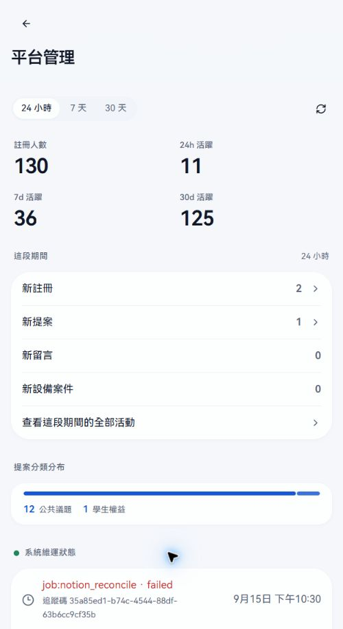

設定頁另有「平台管理員通知」：留言通知、提案更新、設備更新。這些開關只調整目前管理員的通知偏好，不會替其他人的帳號設定。

## 管理設定的儲存流程

「內容與分類」、「平台設定」及管理員指派採**草稿制**：

1. 修改內容，底部會列出未儲存變更數。
2. 檢查改了哪些項目；有多個分頁時，也要檢查同頁其他分頁是否留有草稿。
3. 按「儲存」才生效。「捨棄」取消本頁草稿、恢復已儲存設定。
4. 若改動需要更新或清理既有資料，會先顯示變更摘要與估計影響筆數。閱讀後再確認。
5. 確認後由背景工作分批套用；到「系統運作」看進度，完成後重開原設定核對。

關閉分類抽屜只回到列表，**不等於儲存**。未儲存就離開時依畫面的離開提示處理。新增分類沒有填完必填欄位時，儲存按鈕可能停用。

帳號限制表單的「套用規則」與系統重試／清理操作有各自的送出及確認流程，不能一概當成還要按底部儲存。

## 內容與分類：提案

開啟「內容與分類」，上方有提案／設備／公告分頁。分類以列表呈現，點分類列開抽屜編輯。

### 功能開關與預設分類

關閉提案功能會隱藏一般使用者的入口，保留既有分類與案件。再次啟用時，需要至少一個有效分類，且恰好一個預設分類。

「預設分類」是提案預選分類。要改預設，開另一分類選「預設分類」，再儲存；原預設會取消。預設分類不能直接刪除。

### 新增分類

1. 按「新增提案分類」，列表先出現一個未儲存草稿。
2. 點草稿，填「名稱」與「識別碼」。名稱不可空白，最多 40 字；識別碼用小寫英數及中間連字號，不可重複。
3. 決定閱讀權限、作者顯示、作者刪除權限與是否啟用附議。啟用附議時填正整數門檻與天數。
4. 依分類用途設定對話與圖片規則，核對內文及附件張數。
5. 關閉抽屜，再按底部儲存。重新開列表確認分類出現且沒有未儲存變更。

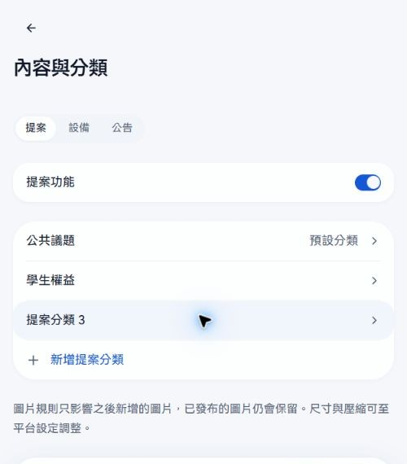

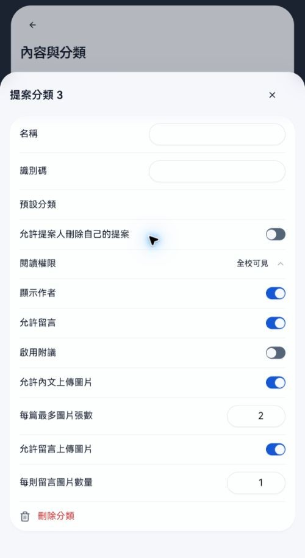

### 閱讀權限與作者顯示組合

| 閱讀權限 | 新案流程 | 作者顯示 |
| --- | --- | --- |
| 全校可見 | 送出即未回覆，不經審核；有附議則從建立時間算期限。 | 可讓一般讀者顯示或隱藏作者，作者與管理員仍可辨識。 |
| 審核後全校可見 | 先待審核，作者與管理員可讀；通過才公開，附議期限從通過時間起算。退件仍不公開。 | 同上。 |
| 僅作者與管理員 | 送出即未回覆，其他學生無法閱讀。 | 系統會讓作者與管理員能識別身分。 |

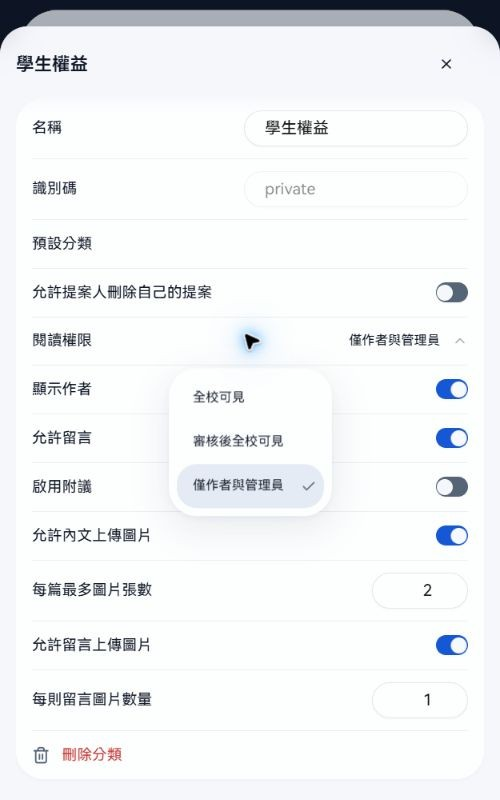

分類建立後，**識別碼、閱讀權限與作者顯示不能更改**。現有介面仍可能讓閱讀權限或作者顯示控制項可點，但送出時不接受此變更。要改隱私規則，先規劃新的分類與後續案件處理；勿把刪舊分類當成搬移資料。

既有分類可修改名稱、預設、作者刪除、附議與可調整的互動／圖片規則。

### 本校目前的兩個提案分類

| 分類 | 閱讀與處理 | 附議 | 內文圖片 | 作者自行刪除 |
| --- | --- | --- | --- | --- |
| 公共議題 | 審核後全校可見；一般讀者隱藏作者 | 50 人／審核通過後 14 天 | 每篇 2 張 | 未開放 |
| 學生權益 | 僅作者與管理員，直接進入未回覆 | 未啟用 | 每篇 2 張 | 未開放 |

學生權益開放作者與管理員留言，每則可附 1 張圖片。依這些規則處理案件的完整步驟見分類管理員手冊。

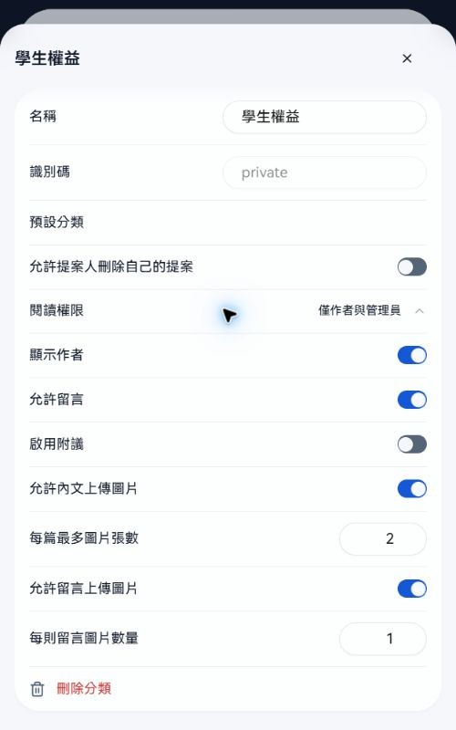

### 規則對既有資料的影響

| 變更 | 生效方式 |
| --- | --- |
| 附議開關、門檻、天數 | 影響之後新建的提案；不重算既有案件的門檻或期限。 |
| 允許作者刪除 | 決定作者能否刪自己的案件；負責該分類的管理員始終有管理刪除權限。 |
| 分類留言關閉 | 背景工作會把既有案件的新留言入口關閉。再次開啟不會直接重開已結案、退件或個別關閉的案件。 |
| 內文／留言圖片開關與張數 | 限制之後新增的圖片；已發布圖片保留。 |
| 刪除整個分類 | 分類下案件與關聯資料一併永久刪除。 |

分類管理員不能修改上述政策。發布教學截圖時也要遮蔽管理員帳號能看到的作者。

### 新版圖片規則

**圖片張數在「內容與分類」設定**，不是在平台設定中設定全平台統一張數。

每個提案分類可分別設定「允許內文上傳圖片」和「每篇最多圖片張數」；分類允許留言時，另有「允許留言上傳圖片」及「每則留言圖片數量」。關閉圖片開關代表不接受新圖片；開啟時填 1–20 張。

例如學生權益內文 2 張、每則留言 1 張是兩個獨立上限。修改後按儲存，再用對應分類的新增表單或輸入框確認，不要用另一分類的畫面判斷。

### 刪除分類

1. 確认刪的是哪一個分類，以及其中案件是否需要留存。
2. 若為預設分類，先指定其他預設並完成必要設定。
3. 開分類抽屜，按「刪除分類」，閱讀資料影響警告。
4. 此階段確認會把刪除加入草稿；底部再按「儲存」才執行。儲存前可捨棄。
5. 執行後分類內的提案或設備案件、留言、附議／受影響者、通知及上傳圖片永久刪除，無法復原。

## 內容與分類：設備與公告

### 設備尚未開放

設備有獨立功能開關、分類、預設分類、圖片與作者刪除規則。關閉設備功能會隱藏入口，停用新增分類，保留既有資料。

本校目前設備關閉，也沒有設備分類。要正式啟用，須建立有效分類及一個預設分類、指派負責管理員，儲存後確認一般使用者入口與案件流程。設備操作見分類管理員手冊的預備說明。

### 公告設定

公告沒有分類。公告分頁可設定「公告留言」、內文圖片及留言圖片；本校目前公告內文每篇最多 10 張，公告留言每則 1 張。

關閉公告留言會以背景工作更新既有公告；圖片規則只限制後續新增。發布及刪除公告的權限，由人員頁的「公告管理」另行指派。

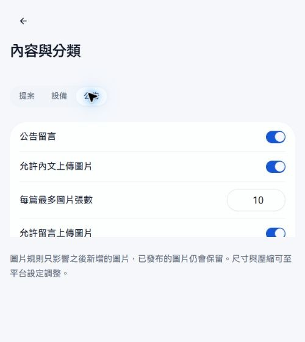

## 平台設定：資料保留

進「平台設定 → 資料保留」。各生命週期以可展開分組呈現，開啟清理開關才顯示相應天數或時數。

| 分組 | 涵蓋資料 |
| --- | --- |
| 內容生命週期 | 已結案提案、已結案設備、舊公告、舊通知。 |
| 帳號與隱私生命週期 | 閒置頭像、閒置個人資料、到期限制、推播裝置保留及確認間隔。 |
| 系統運作紀錄 | 已完成／失敗投遞、操作、事件、已完成／失敗背景工作。 |
| 稽核歷史 | 角色指派、平台管理動作、分類設定及存取指派。 |
| 上傳生命週期 | 待上傳、未附加及失敗上傳資料。 |

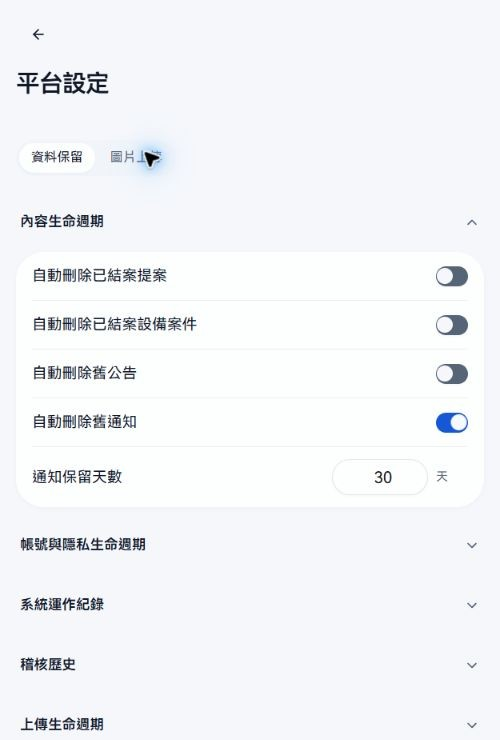

修改前先確認要保留哪種資料，以及單位是天或小時。縮短期限或開啟清理可能移除已存在的紀錄；儲存前會顯示影響估計。確認後看背景工作進度，不能只看到儲存成功就認定所有舊資料已處理完。

本校目前舊通知保留 30 天；已結案提案、設備及舊公告的自動刪除未開啟。實際設定可能日後調整，請以管理畫面為準。

## 平台設定：圖片處理

「平台設定 → 圖片上傳」目前只放全平台共同處理設定：

| 欄位 | 本校核對時的值 | 用途 |
| --- | --- | --- |
| 上傳後圖片大小上限 | 800 KB | 控制處理後的檔案大小。 |
| 圖片最長邊上限 | 2,000 px | 縮放尺寸上限。 |
| WebP 品質 | 0.82 | 圖片壓縮品質。 |

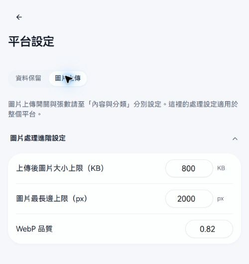

先分清楚「張數」和「大小／尺寸／品質」：張數到內容與分類改；壓縮與尺寸在這裡改。更改品質後檢查文字型圖片是否仍清楚；已發布圖片不會因修改設定自動全部重做。

## 人員與權限

### 依帳號查詢

用姓名、校內信箱或 UID 搜尋已登入過的帳號。點帳號列可看 UID、註冊時間、角色、負責範圍及生效限制。列表可用上一頁／下一頁翻頁。

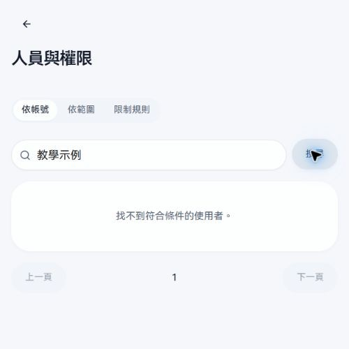

同名時用信箱或 UID 再核對，避免指派錯人。對外使用截圖，需遮蔽姓名、學號、信箱、UID 與頭像。

### 依範圍指派管理員

1. 切「依範圍」，選提案分類、設備分類或公告管理。
2. 前兩者再選具體分類；公告管理是全域，不用選分類。
3. 查看「目前負責人」，確認要新增或撤銷的對象。
4. 在「尋找並指派成員」用姓名、信箱或 UID 搜尋。選候選人後指派，已在此範圍的成員會顯示已授權。
5. 撤銷圖示與新增指派先進入草稿。底部按儲存才生效；捨棄取消。
6. 重新開相同範圍，確認負責人名單。

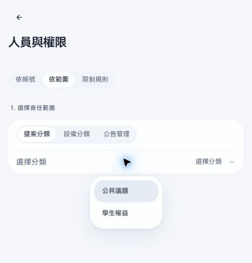

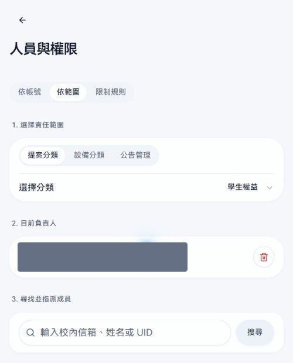

同一人可同時管理多個提案、設備分類及公告。授權不會讓他取得平台政策與人員管理權限；平台總管理員不需逐分類授權。

### 限制單一帳號或帳號前綴

「依帳號」可針對單一 UID 設限制；「限制規則」可依校內信箱 @ 前的帳號開頭，持續匹配現有與未來的新帳號。單一 UID 規則優先於前綴規則，平台總管理員不受這些互動限制。

| 存取模式 | 影響 |
| --- | --- |
| 唯讀 | 可以閱讀，不能新增、留言、上傳、附議或按讚等。 |
| 僅可附議、按讚與標記我也遇到 | 可做這些反應，不能新增、留言或上傳。 |
| 完全封鎖 | 受保護請求被拒絕。 |

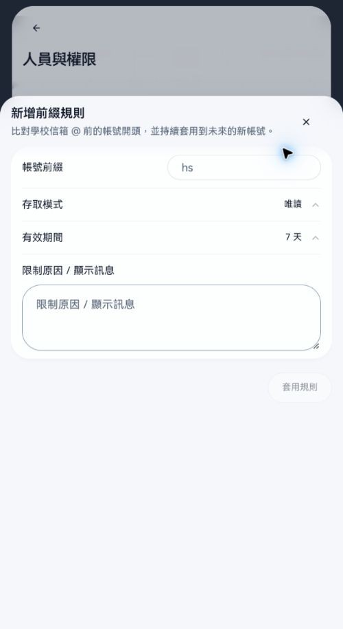

操作時填目標、模式、有效期間與「限制原因／顯示訊息」。原因會顯示給使用者，應寫清楚原因與解除條件。期限可選 7 天、30 天、自訂或永久；自訂輸入時數。

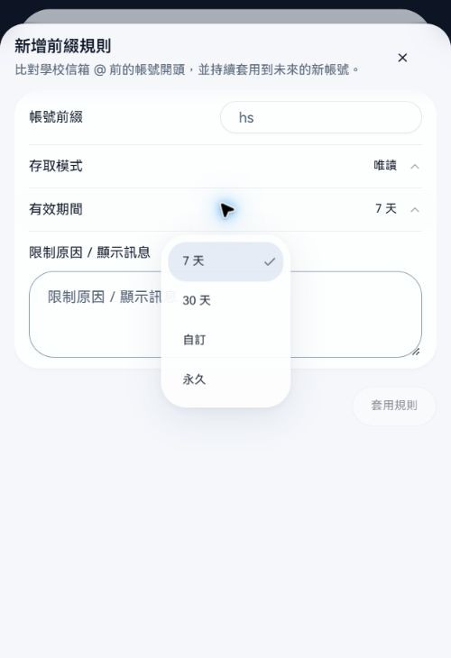

套用前核對符合人數，前綴過短會影響整批帳號。前綴建立後不能改前綴，要先移除再另建；單一帳號例外與前綴規則要分別檢查。只要存取限制生效，使用者原本的管理授權也不能當成繞過限制的方法。

## 稽核紀錄

「管理動作」記錄執行者、時間、操作、目標 ID 與細節。搜尋後點一筆查看。分類變更、授權、案件狀態、刪除、平台政策及系統清理等都會留下管理紀錄。

「平台活動」依期間看帳號與內容活動。查某個時間段的使用狀況，選平台活動；追查誰改了設定，選管理動作。

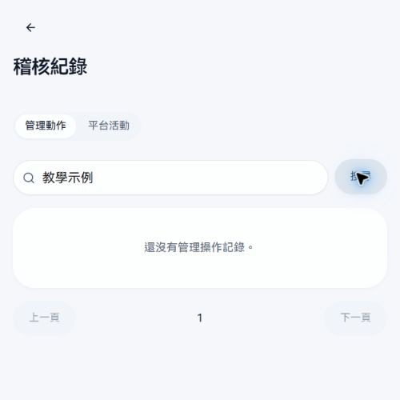

## 系統運作

### 失敗與重試

先查看「排隊中的工作」、「投遞」與「Worker 錯誤紀錄」，再判斷要處理哪一類。

- 失敗的背景工作或投遞：開詳情，核對錯誤與目標，符合重試條件時單筆或批次重試，之後查看是否完成。
- Worker 錯誤紀錄：用來追查某次請求失敗，不是在該列重新執行原請求。找不到內容、沒有附議權限或存取受限，也可能留下紀錄。
- 工作仍在執行：先看進度，避免為同一問題反覆排程。

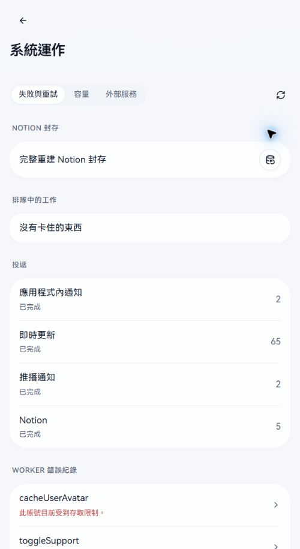

### 完整重建 Notion 封存

「排程重建」會依資料庫的目前內容，重寫內容、狀態、時間、留言與維運紀錄。

確認視窗會說明：舊 Notion 同步佇列、失敗紀錄與前次重建會清掉，其他通知佇列不受影響；**既有 Notion 頁面不會自動刪除**。需要換掉的舊頁面須另行處理。

閱讀後再確認排程，回本頁看分批進度。不要只為更新這份教學手冊而執行封存重建，這是不同用途。

### 清除排程及錯誤

「清除所有排程」會停止目前等待中、執行中及失敗的背景工作，清掉外部資料刪除待辦；已完成歷史與未來新增工作保留。這可能中斷正在套用的分類或資料清理，先確認目前工作。

「清除所有 Worker 錯誤」只清目前錯誤紀錄，並不修正造成錯誤的原因。需要追查時先保存時間、追蹤 ID 和原因。兩個操作各有確認視窗。

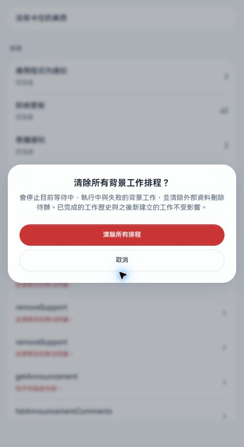

### 容量與外部服務

「容量」顯示資料庫總量、近期樣本與主要資料表。「全部」可查看每張表的列數、待清版本與大小。圖上數字是查詢當時的快照。

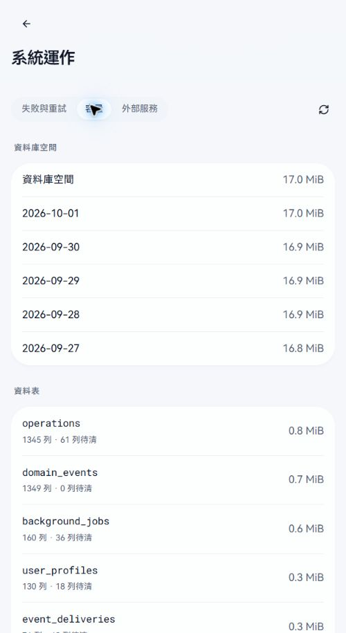

「外部服務」查看 Cloudinary 用量、Workers 最近 24 小時統計與原始回應。各區可重新整理；Worker 紀錄需輸入追蹤 ID 或事件關鍵字後搜尋。

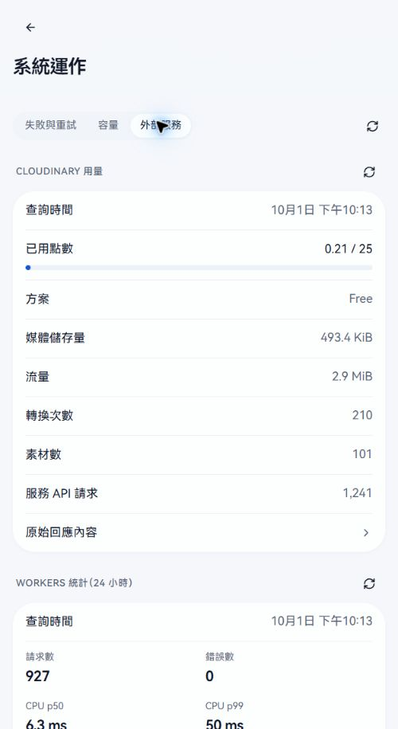

看到錯誤數先核對查詢時間、錯誤類型及實際影響，不能直接把歷史紀錄當成當下服務中斷。

## 運行政策

這裡會改變實際輸入限制、配額、請求及背景工作行為。選「內容／配額／進階」修改，底部填**變更原因**後儲存；每次成功會產生新版本，可從「設定修改紀錄」看前後差異。

| 分頁 | 設定內容 |
| --- | --- |
| 內容 | 標題、內文、留言、結果、地點及搜尋長度。 |
| 配額 | 每 10 秒的讀寫、管理及圖片請求；每日或每小時的新增、互動、通知和刪除等上限。 |
| 進階 | 紀錄保存、前端請求與節流、工作批次、即時連線。 |

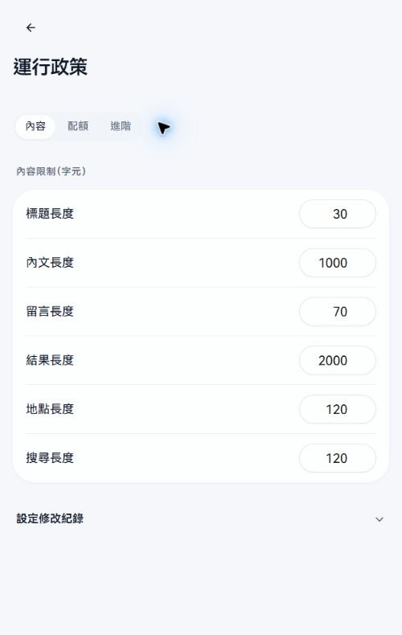

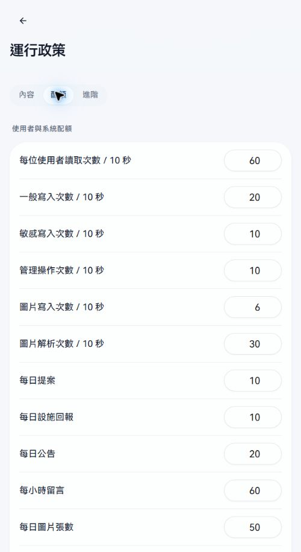

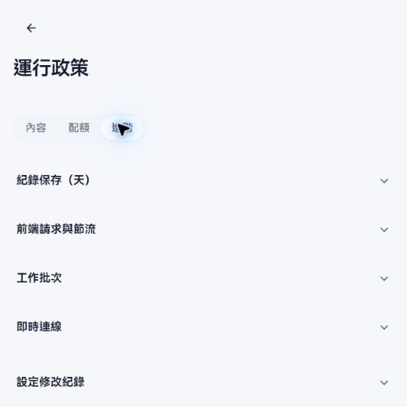

字數欄位單位是字元；頻率欄位分 10 秒、每小時、每日，修改前看清楚。請求逾時、快取、重試、批次與連線設定應由維運人員評估，改完用對應操作核對成功結果和錯誤紀錄，不要一次改大量不相干參數。

## 公告發布與管理

1. 到「列表 → 公告」，按右上 **＋（新增公告）**。
2. 填標題與內容，必要時在圖片附件加入圖片。本校目前每篇公告最多 10 張。
3. 工具列提供標題、粗體、斜體、清單、連結；更多格式包含表格等。
4. 確認後按「發布公告」，成功後開公告詳情，檢查標題、內容及圖片。
5. 文字草稿在目前分頁保留最多 24 小時；圖片離開後需重選，登出會清草稿。
6. 既有公告右上「更多操作」可刪除；刪除前確認不是只想更正內容，因為刪除後無法復原。

公告開放留言時，可用底部固定輸入框回覆及附圖，查看排序與回覆串。目前介面只在自己發布的留言旁顯示刪除圖示；不要假定一般管理頁提供刪除所有留言的按鈕。

另行取得「公告管理」權限的人也能發布／刪除公告，但不能因此修改平台設定或管理人員權限。

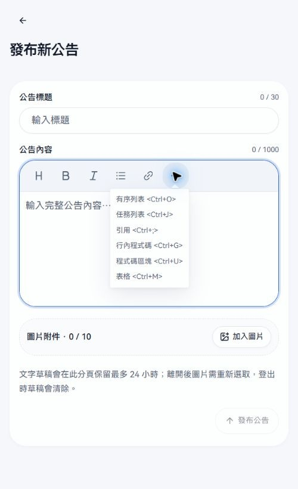

若從列表按新增公告卻開成「公告載入失敗」，可在新增網址重新整理一次，讓頁面直接載入新增表單。本次正式站已確認此方式可開啟；這個狀況和公告管理權限不足不同。

## 完成一項管理變更後

重新開原設定確認值，查看相關案件或一般使用者入口；涉及背景工作時再確認工作完成。把變更原因、範圍與需要交接的資訊留在可追查的管理紀錄中。
