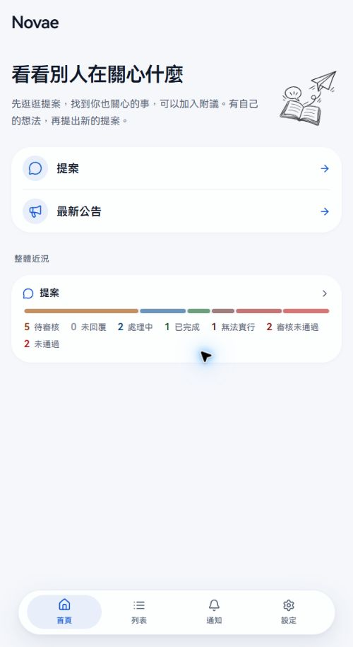
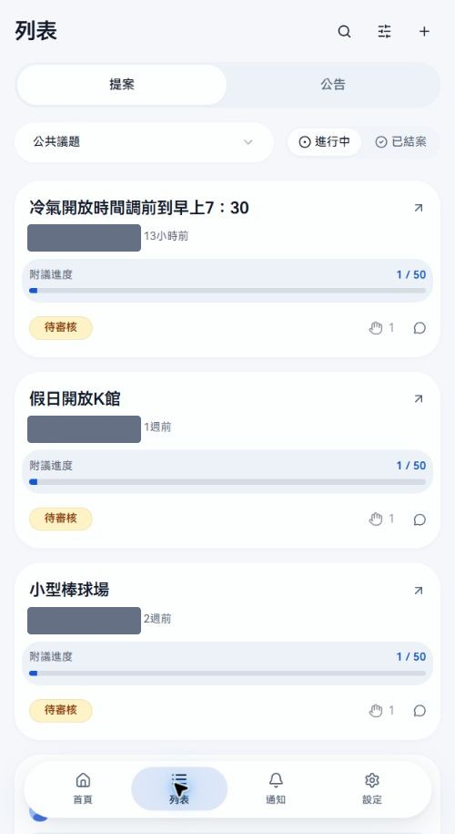
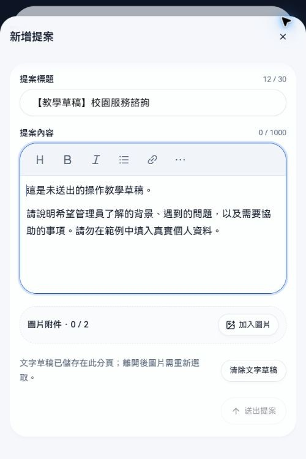
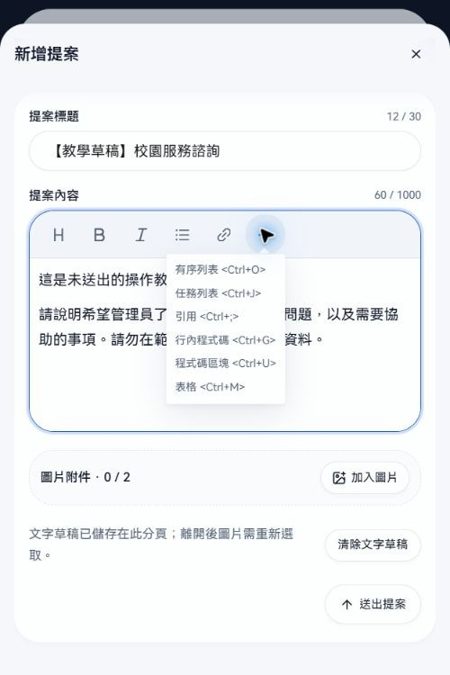
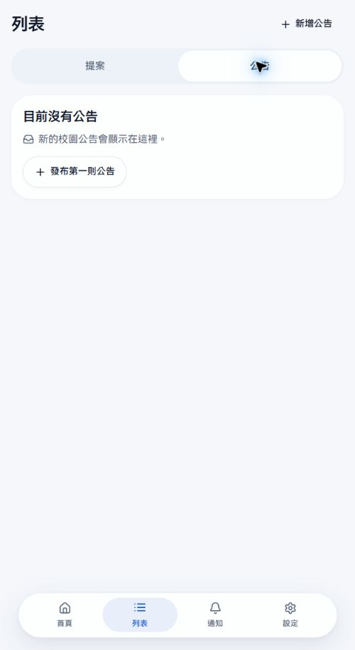
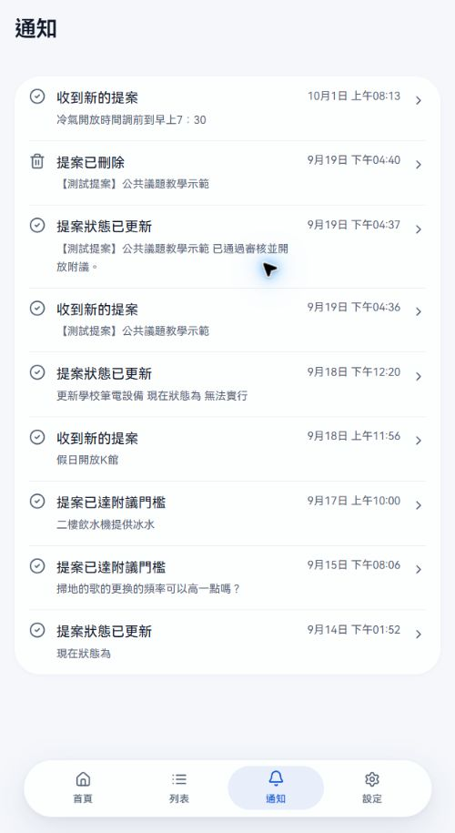
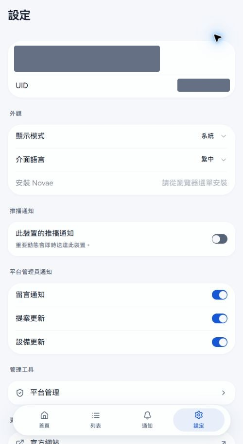

# Novae 使用教學｜南科實中

更新日期：2026-10-01。依本校目前開啟的功能、正式站介面與分類規則整理。

Novae 用來瀏覽校園提案、提出改善想法、反映學生權益問題，以及閱讀公告。請使用學校帳號登入。

本手冊的提案截圖使用管理員帳號，可能顯示一般使用者看不到的待審核案件。作者身分已遮蔽，請依文字說明判斷自己的閱讀權限。

## 先認識新版導覽

手機底部有 **首頁、列表、通知、設定** 四個入口；電腦版放在左側。提案與公告都在「列表」中，用上方分頁切換。

「首頁」提供「提案」和「最新公告」捷徑，下方的「整體近況」呈現案件狀態分布。點提案捷徑或近況區可進入列表。近況是整體件數，能看見統計不代表能閱讀每一件案件。

本校目前開放提案與公告；**設備功能尚未開放，仍在與學校溝通**，所以列表不會出現設備分頁。

## 安裝到手機或電腦

安裝後可從主畫面開啟 Novae。仍可直接用瀏覽器使用，不必先安裝才能發案。

1. 開啟 Novae，登入學校帳號。
2. 到「設定」查看「安裝 Novae」。如果可用，按下並依瀏覽器提示完成。
3. 若顯示「請從瀏覽器選單安裝」，改用以下方式。

| 裝置 | 操作 |
| --- | --- |
| iPhone／iPad | 用 Safari 開啟網站，按分享，選「加入主畫面」，再按「加入」。 |
| Android | 用 Chrome 開啟網站，開啟右上角選單，選「安裝應用程式」或「加入主畫面」，依提示完成。 |
| 電腦 | 在支援安裝的 Chrome／Edge 使用網址列的安裝圖示，或瀏覽器選單中的安裝選項。 |

不同系統的選單名稱可能略有差異。安裝完成後，從新增的 Novae 圖示開啟。

## 找到想看的提案

1. 按「列表」，確認上方選在「提案」。
2. 按分類選單，選「公共議題」、「學生權益」或「我的提案」。
3. 切換「進行中／已結案」。
4. 按提案卡片或右上箭頭，開啟詳情；看完按右上「關閉」回列表。

### 搜尋與排序

上方放大鏡可開啟搜尋，輸入關鍵字後執行搜尋。短關鍵字會先篩選已載入的提案；至少 3 個字時會再查詢更多結果。搜尋可以比對標題、內文或允許顯示的作者資訊。

旁邊的排序圖示可切換「最新、最多附議、即將截止」。搜尋與排序會跟目前分類及進行中／已結案一起作用；查不到時先清除搜尋，再檢查分類和狀態。下方有「載入更多」時，可繼續載入。

### 我的提案

「我的提案」集中顯示自己送出的案件。公共議題還在審核時，或學生權益本來就不公開時，從這裡找最快。這個列表沒有新增提案按鈕；要發案，先切回實際分類。

## 公共議題

用來提出希望全校一起關注、需要公開附議的校園議題。

送出後先進入「待審核」。**審核中與審核未通過的案件只有作者及該分類管理員能閱讀**，不會出現在其他同學可閱讀的公開列表。審核通過後才公開，並開始計算附議期間。

| 規則 | 本校目前設定 |
| --- | --- |
| 附議門檻 | 50 人 |
| 附議期限 | 審核通過後 14 天 |
| 作者的附議 | 送出時已計入 1 人，不能再替自己的提案附議一次 |
| 公開作者身分 | 一般讀者不顯示作者；作者本人與管理員仍能辨識 |
| 作者自行刪除 | 目前未開放，需要處理時請聯絡負責管理員 |

審核期間附議按鈕停用。通過後，在可附議期間按手掌圖示加入附議；已附議時可取消。達到門檻後，案件轉入「處理中」；曾達標的紀錄不會因有人取消附議而自動倒退。

如果期限到時仍未達門檻，案件會移到「已結案」。狀態可能顯示「未通過」或「未達門檻」，都表示這次附議沒有達標。這和管理員在審核階段退件的「審核未通過」不同。

### 看懂提案狀態

| 列表 | 狀態 | 意思 |
| --- | --- | --- |
| 進行中 | 待審核／審核中 | 管理員正在審核，尚未公開。 |
| 進行中 | 未回覆／待處理 | 案件已開放，尚未進入處理中；公共議題可能仍在累積附議。 |
| 進行中 | 處理中 | 已達附議門檻，或管理員已接手。 |
| 已結案 | 已完成 | 已完成處理，可到詳情看處理結果。 |
| 已結案 | 無法實行／無法執行 | 無法執行，原因記在處理結果。 |
| 已結案 | 審核未通過 | 審核階段退件，僅作者與管理員可讀。部分表單簡寫為「未通過」。 |
| 已結案 | 未通過／未達門檻 | 公開後的附議期限已到，未達門檻。請搭配時間軸判讀。 |

列表徽章和管理表單有少數不同用字，請以案件階段、時間軸和處理結果確認，不要只看「未通過」三個字。

## 學生權益

這是私密的意見反映管道，**只有提案作者與該分類管理員能閱讀**。不公開給其他同學，也不需要附議。分享連結不會替收件人增加閱讀權限。

送出後直接是「未回覆」，可在案件內補充資料、與管理員對話，或回答管理員的問題。

### 補充資料與回覆

在詳情下方查看留言，輸入框固定在畫面底部。輸入文字後按向上箭頭送出；電腦也可按 Ctrl／Command + Enter。

- 按某則留言的「回覆」圖示，輸入框上方會顯示回覆對象與原文摘要；按取消可回到一般留言。
- 回覆可展開或收合；留言排序可切「從新到舊／從舊到新」。
- 本校目前學生權益的**每則留言可附 1 張圖片**。按「加入圖片」，檢查預覽，再送出；也可以只送圖片。
- 文字草稿會暫存在目前分頁；圖片離開後需重新選取。送出成功才算正式留下紀錄。
- 已結案案件不接受新留言；若需繼續處理，請聯絡管理員。
- 自己的留言旁若有垃圾桶圖示，可刪除自己的留言。刪除前先確認內容。

目前學生權益允許每篇提案附 2 張圖片，作者自行刪除案件未開放。需要更正或撤回已送出的案件時，請向該分類管理員說明。

## 發起新提案

1. 到「列表 → 提案」，先選正確分類。
2. 按右上 **＋（新增提案）**。確認是要公開附議的公共議題，或私密處理的學生權益。
3. 填「提案標題」與「提案內容」，兩項都必填。目前標題上限 30 字元、內文上限 1,000 字元，表單會顯示計數。
4. 需要時按「加入圖片」。目前兩個提案分類各可附 2 張，縮圖可預覽或移除。
5. 確認內容及圖片後按「送出提案」，成功後開啟案件詳情。
6. 公共議題等待審核；學生權益可直接等待管理員回覆並補充資料。

公共議題可交代現況、希望改善的方式和理由。學生權益請把時間、背景、已嘗試的處理方式和需要協助的事項寫清楚。圖片中的姓名、學號、聊天紀錄等資料，請先確認有必要提供。

### 編輯器與草稿

工具列有標題、粗體、斜體、無序列表與連結。「更多」提供有序列表、任務列表、引用、行內程式碼、程式碼區塊與表格。圖片從「圖片附件」區加入。

文字草稿在**目前分頁**保留最多 24 小時。關閉新增畫面不代表已送出；重新進入相同分類可恢復文字。離開後圖片需重新選取，登出會清除草稿。若不再使用，按「清除文字草稿」。

送出失敗時先看畫面的錯誤訊息，確認網路、字數與附件張數，再重試；不要連續按送出。若跳出登入驗證，依畫面完成本人驗證後繼續。

## 公告

按「列表 → 公告」，或從首頁按「最新公告」。一般使用者只能閱讀；有公告管理權限的人才會看到新增入口。

點公告閱讀完整內容、發布時間及圖片。心形按鈕可按讚或取消按讚，分享按鈕可分享連結；裝置不支援系統分享時會複製連結。

公告開放留言時，可用底部輸入框留言或回覆、切換排序。目前每則公告留言可附 1 張圖片，操作和學生權益的留言相同。公告內文可附的圖片張數由管理員另行設定。

## 通知

「通知」集中顯示與帳號有關的新動態，例如審核結果、案件狀態更新、附議達標、學生權益的回覆與新公告。導覽圖示旁的紅點表示有未讀通知。

點通知會開啟對應內容。若內容被刪除或目前帳號沒有權限，會顯示不存在或無法查看；取得連結也不會改變閱讀權限。

## 設定與推播

「設定」上方顯示目前帳號；按 UID 可複製帳號識別碼，聯絡管理員處理帳號問題時可提供。

- 「外觀」可調整顯示模式為亮色、深色或系統，介面語言可切繁中／English。
- 「此裝置的推播通知」控制目前裝置的通知。按開關後依瀏覽器提示允許；若曾封鎖，需到瀏覽器或系統設定重新允許。
- iPhone／iPad 可先加入主畫面，再從主畫面開啟 Novae 設定推播；實際可用性依裝置及系統提示。
- 「更多資源」可開官方網站、GitHub，或重新啟動應用程式。
- 頁面下方可切換帳號或登出。

截圖使用管理員帳號，因此有「平台管理員通知」與「管理工具」。一般使用者不一定會看到這些項目。

## 遇到問題時先檢查

| 狀況 | 處理方式 |
| --- | --- |
| 公共議題送出後同學找不到 | 先看是否仍在待審核，從「我的提案」找自己的案件。 |
| 找不到自己的舊案件 | 切「我的提案 → 已結案」，清除搜尋。 |
| 附議按鈕停用 | 檢查是否為自己的提案、仍在審核、已結案或超過期限。 |
| 學生權益沒有附議 | 這是作者與管理員之間的私密管道，可在案件內補充資料。 |
| 圖片按鈕沒有出現或不能再選 | 檢查該內容是否允許圖片、是否已到張數上限。 |
| 無法新增或互動 | 查看帳號限制或配額訊息；等提示時間後再試，必要時聯絡管理員。 |
| 找不到設備 | 本校目前尚未開放設備功能。 |
| 畫面卡住或載入失敗 | 檢查網路，使用「重試」或「設定 → 重新啟動應用程式」。 |

## 管理員手冊

[平台總管理員操作手冊](platform-admin.md)

[分類管理員操作手冊](category-manager.md)
