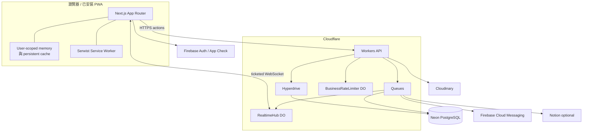
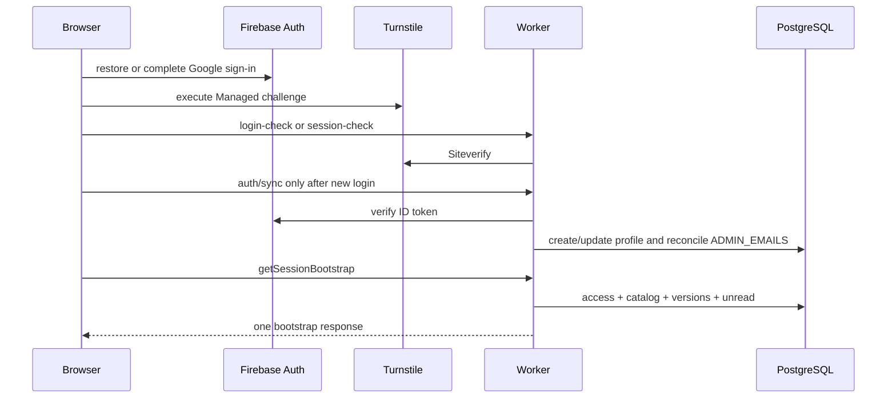
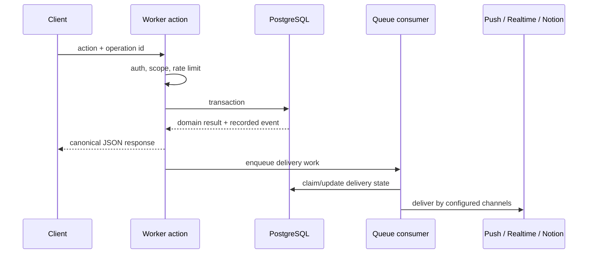

# 系統架構

## 元件圖

## 前端邊界

`src/app/` 的 route 負責組裝畫面，資料讀寫透過 hooks 進入 `src/services/`，不直接從 page 或 presentation component 呼叫服務。`src/components/ui/` 只放無業務邏輯的元件；各 domain component 位於自己的目錄。

登入後，`use-session` 恢復 Firebase session、完成 Turnstile / App Check 驗證並向後端取得 authoritative role、scope、feature 和 setup 狀態。前端快取以使用者為 namespace；content entity、列表 snapshot 和附議等 optimistic state 分開管理。

### 目錄責任

| 位置 | 責任 |
| --- | --- |
| `src/app/` | App Router layout、page、loading boundary、service worker 與版本 endpoint |
| `src/components/ui/` | 不含業務 import 的視覺 primitive |
| `src/components/{issues,facilities,announcements,...}` | Domain presentation 與使用者互動 |
| `src/hooks/` | Route / domain state、請求生命週期、mutation orchestration |
| `src/services/` | Browser 對 Worker、Firebase、upload 與 realtime 的唯一 I/O boundary |
| `src/lib/` | 無框架或可獨立測試的 cache、request、Markdown、route、security helper |
| `src/generated/` | 由 `config/` 產生的 committed contract |
| `src/i18n/` | Reactive locale store 與 `en` / `zh-TW` catalog |

Route page 不直接 import `services/`。這條規則由 architecture test 和 UI check 執行，避免資料存取散到 view 裡。

### 啟動與 session

恢復既有 session 不重做 profile write；只有新登入呼叫 `/v1/auth/sync`。Bootstrap 把 access、category catalog、content version 和 unread hint 合在同一個 Edge invocation，降低冷啟動的往返次數。

### 快取分層

Novae 沒有用一個全域 store 裝全部資料：

- normalized entity store 讓列表、詳情、mutation 和 realtime 共用同一筆 issue / facility / announcement。
- view-memory cache 保存 query、pagination 與 dashboard 的畫面 snapshot，期限 30 分鐘。
- persistent content cache 以 UID 分區，最長 30 天、最多 500 筆、估算上限 16 MiB；讀到過期資料會當場移除。
- feed 在 React state 和 DOM 只留五頁。
- session 結束會清掉使用者 namespace，避免下一個登入者看見上一個人的 cache。

## API 邊界

`cloudflare/src/index.ts` 是唯一公開 Worker 入口。一般資料操作集中在 `POST /v1/actions`，另外提供 auth sync、session check、realtime ticket、Cloudinary webhook、簽名媒體讀取與 WebSocket 入口。

每次 API operation 都有 `X-Novae-Operation-Id`。Worker 驗證 Origin、Firebase ID token、Firebase App Check 與適用的 rate limit，再交給 generated action registry。首次建立 profile 額外受 Managed Turnstile 保護。

公開路由只有 `cloudflare/src/index.ts` 列出的 `/v1/*`。Worker 回應統一加上 CORS 與 `cache-control: no-store`；內部例外轉成 canonical API error。5xx 另外產生 `failureId`，log 同時帶 `invocationId`、`operationId` 和 action / path，方便把一次失敗從 Edge 追到資料庫與 Queue。

## 寫入與事件

Domain event 與主要寫入同一個 transaction 落庫。Queue 可以重試 delivery 或背景工作，但 PostgreSQL 仍是 source of record；Durable Object 只保存 rate-limit / WebSocket 執行狀態。

所有 write action 必須帶合法 UUID operation ID。Transaction 先呼叫 `claim_operation`：已完成的相同 operation 直接回傳原 response，正在執行的重複 request 回 `request-in-progress`。Domain mutation、admin audit、domain event 和 `complete_operation` 任一步失敗，整筆 transaction rollback。

Read action 與 upload URL resolution 不 claim operation，也不開 mutation transaction。它們仍要經身分、Origin、permission、scope 和 rate limit。

## 資料與安全

- Browser 不載入 PostgreSQL client，也沒有任何資料庫連線字串。
- Worker 透過 Hyperdrive 使用 `novae_runtime`；該 role 只有 DML、sequence use 與函式執行權，沒有 DDL 或 role-management 權限。
- PostgreSQL 以 `app_private` 保存資料、以 `app_api` 暴露 permission-checked RPC。
- 平台管理員只由 `ADMIN_EMAILS` 對 Firebase email 進行後端 reconciliation。
- CSP nonce、Permissions Policy、Referrer Policy 與 content-type sniffing protection 由 Next proxy / headers 設定。

更完整的 role、permission、route guard 與 restricted-user 行為見[路由、角色與權限](routes-and-permissions.md)。

## Realtime 與快取

通知保持全域 realtime；提案、設施與公告只在對應 route family 訂閱。瀏覽器共用一條 socket，閒置 30 分鐘後關閉，重新活動或回到前景才重連並去重 resync。列表最多保留五頁，persistent cache 有期限、筆數與容量上限；遠端 content version 改變時會清除受影響 domain 再重新載入。

Realtime 只傳變更訊號與可安全 patch 的 count，不取代 authoritative read。圖片也不直接公開 Cloudinary URL；完整事件 destination、topic、Push preference 和 upload lifecycle 見[事件、即時更新、通知與圖片](events-realtime-and-media.md)。

## PWA 與瀏覽器殼層

`src/app/sw.ts` 由 Serwist 編譯成 `public/sw.js`。Development mode 關閉 Serwist；production 才註冊 service worker。WOFF2 字型 shard 不放進 install-time precache，瀏覽器依 unicode range 正常載入。

`version.json` 和 `sw.js` 都設為 no-cache。App update gate 會輪詢版本、在有限時間內要求更新，失敗時保留重新載入路徑。Viewport 使用 stable small-viewport 和 standalone PWA 規則；mobile navigation 會避開 safe area 與鍵盤，discussion composer 的底部空間由 CSS safe area 加上 ResizeObserver 實測高度決定。

## 部署拓撲

Frontend 在 Vercel build，API、Queue、Durable Object、cron 與 native rate-limit binding 都在 Cloudflare。Neon owner credential 只存在 GitHub deployment job；job 套完 migration 後建立 `novae_runtime`，把 runtime URL 寫進 Hyperdrive。Cloudinary、Firebase 與 Notion credential 只進 Worker secret，`NEXT_PUBLIC_*` 才進 browser bundle。
