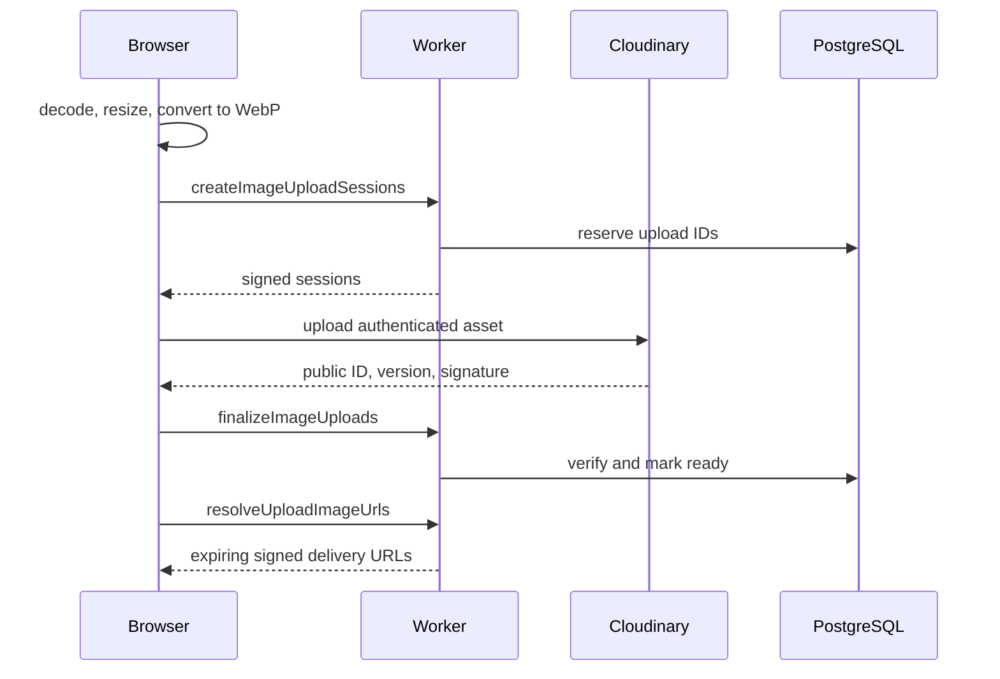

# 事件、即時更新、通知與圖片

Novae 的寫入不會直接從 request handler 呼叫四五個外部服務。Action 先完成 PostgreSQL transaction，同一筆 transaction 記錄 domain event 和 delivery；成功 response 回給前端後，Worker 才送出 `drain` queue message。這個順序讓主要資料先落定，也讓外部服務失敗可以重試。

## Event destination

每個 event 可以選擇 `notion`、`in_app`、`push`、`realtime`。目前幾個最重要的 mapping 如下：

| Event | Destinations |
| --- | --- |
| `issue.created`、`issue.status_changed`、`issue.deleted` | Notion、站內通知、Push、Realtime |
| `support.goal_met` | Notion、站內通知、Push、Realtime |
| 一般 `support.toggled` | Notion、Realtime |
| `issue.comment_created` | Notion、站內通知、Push、Realtime |
| `issue.result_updated`、`issue.comment_deleted` | Notion、Realtime |
| `facility.created`、`facility.status_changed` | Notion、站內通知、Push、Realtime |
| `facility.affected_toggled` | Realtime |
| `facility.deleted` | Notion、Realtime |
| `announcement.created`、`announcement.comment_created` | Notion、站內通知、Push、Realtime |
| `announcement.liked` | Realtime |
| `announcement.deleted`、`announcement.comment_deleted` | Notion、Realtime |
| setup、feature、category、platform setting、user scope / restriction | Notion、Realtime |
| `admin.audit_recorded` | Notion |
| 通知已讀、avatar 更新 | Realtime |
| Push token、upload、deletion retry | 不送外部 destination，仍保留 operation 一致性 |

Admin write 的稽核資料也在原 transaction 中寫入 `admin_audit_log`，接著產生 `admin.audit_recorded`。Audit detail 會排除 `content` 和 `resultContent`，避免把完整內容複製進管理稽核 payload。

## Queue 與背景工作

Worker 的 Queue consumer 逐筆處理 message；成功就 `ack()`，發生錯誤則 `retry()`。Wrangler 設定一次最多收 10 筆、最多等 5 秒，單筆最多重試 5 次。

Queue message 分成 delivery drain、maintenance 與可觀察的 background job。全域 category policy 或 retention 異動先估算影響，確認後切成有上限的批次；進度、成功或失敗結果寫回 PostgreSQL，管理頁可以查。Cron 每 30 分鐘只送出 maintenance message，不在 scheduled handler 裡直接跑長 transaction。

## Realtime connection

Client 先呼叫 `POST /v1/realtime/ticket` 取得短效 ticket，再連到 `/v1/realtime` 的 `RealtimeHub` Durable Object。瀏覽器共用一條 transport，不為每個 component 建 socket。

通知從登入後就訂閱：

- `notifications:broadcast`
- `notifications:user:{uid}`
- 平台管理身分額外訂閱 `notifications:admin`
- `notification-state:{uid}`

內容 realtime 只在 `/issues`、`/facilities`、`/announcements` route family 啟動。一般使用者訂閱 `content:school` 與自己的 `content:user:{uid}`；管理身分改訂 `content:admin`。離開這些 route 後會移除 content topics，但通知 transport 仍可維持。

30 分鐘沒有有效活動時 transport 主動關閉。使用者再次互動或頁面回到前景後才重連；重連的 resync callback 會去重。Event 帶 `domainRevision` 和 `aggregateRevision`，client 若發現 revision gap，不猜缺了哪一筆，直接重抓 content versions 和 authoritative data。

## Client cache 更新

Realtime event 先讓對應 cache prefix 失效：

- issue 變動清除列表、搜尋、我的提案與目標詳細頁；留言另清 comment page。
- facility 變動清除 facility list 和 detail。
- announcement 變動清除 list、detail 與必要的 comment page。

Support count、announcement like count 和 comment count 若帶有較新的 aggregate revision，會直接 patch normalized entity，畫面不必等完整重抓。舊 revision 不能蓋掉較新的 optimistic 或 server-confirmed state。

## 站內通知與 Push

通知頁合併三種 source：`broadcast`、`admin`、`user`。Cursor 使用 `{ createdAt, id }`，各 source 分頁後由 hook 合併；列表同樣受五頁 retention ceiling 約束。未讀 hint 另有兩分鐘短 cache，realtime insert 或 read-state event 會讓它失效。

個人 Push preference 包含：

- `comments`
- `issueUpdates`
- `facilityUpdates`

Push token 以 device ID 管理。登入 shell 會做 heartbeat；client 將確認頻率限制為七天。共用裝置若換帳號，後端會重新指派 token。手機瀏覽器若尚未安裝 PWA，設定頁先走安裝引導；通知 permission 一旦被系統拒絕，只能到瀏覽器或作業系統設定重新開啟。

## 圖片處理與 Cloudinary

Client 選圖後先壓縮成 WebP，再向 Worker 要 signed upload session。預設上傳限制來自 runtime settings：提案 2 張、設施 2 張、公告 10 張、留言 1 張；目標壓縮上限 800 KB、平台硬上限 5,000 KB、最長邊 2,000 px、WebP quality `0.82`，必要時依 `1.0 / 0.7 / 0.5 / 0.4` 比例重試。

內容內只保存 `srp-upload://{uploadId}`，不保存可長期公開的 Cloudinary URL。顯示圖片時，Worker 驗證 viewer scope 後簽發 full / thumbnail URL；client 會在到期前 60 秒停止沿用 cache。Cloudinary webhook 也必須通過 provider signature，才會更新 upload lifecycle。

建立內容失敗時，composer 會請後端清理由這次操作上傳的圖片。實際刪除若失敗，工作會進 deletion job；具權限的管理員可在 dashboard 查詢並重試。
